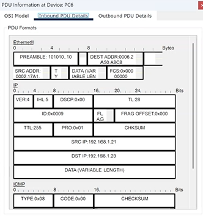
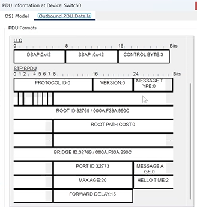

---
## Front matter
lang: ru-RU
title: "Презентация по лабораторной работе №1"
subtitle: "Дисциплина: Администрирование локальных сетей"
author:
  - Доберштейн А.C.
institute:
  - Российский университет дружбы народов, Москва, Россия
date: 04 марта 2025

## i18n babel
babel-lang: russian
babel-otherlangs: english

## Formatting pdf
toc: false
toc-title: Содержание
slide_level: 2
aspectratio: 169
section-titles: true
theme: metropolis
header-includes:
 - \metroset{progressbar=frametitle,sectionpage=progressbar,numbering=fraction}
 - '\makeatletter'
 - '\beamer@ignorenonframefalse'
 - '\makeatother'
---

# Информация

## Докладчик

  * Доберштейн Алина Сергеевна
  * 1132226448
  * НФИбд-02-22

# Цель работы

Установка инструмента моделирования конфигурации сети Cisco Packet Tracer, знакомство с его интерфейсом.

# Задание

1. Установить на домашнем устройстве Cisco Packet Tracer.
2. Постройте простейшую сеть в Cisco Packet Tracer, проведите простейшую настройку оборудования.

# Выполнение лабораторной работы

##

Установила в своей ОС Cisco Packet Tracer и заблокировала для него доступ в интернет.

{#fig:001 width=50%}

##

Создала новый проект. В рабочем пространстве разместила концентратор (Hub-PT) и четыре оконечный устройства PC. Соединила оконечные устройства с концентратором прямым кабелем. Задала статические IP-адреса 192.168.1.11, 192.168.1.12, 192.168.1.13, 192.168.1.14 с маской подсети 255.255.255.0.

{#fig:002 width=30%}

##

В основном окне проекта перешла из режима Realtime в режим Simulation. Выбрала на панели инструментов мышкой "Add simple PDU (P)" и щелкнула сначаоа на РС0, затем на РС2. На панели моделирования нажала кнопку «Play» и проследила за движением пакетов ARP и ICMP от устройства PC0 до устройства PC2 и обратно.

##

Щелкнув на строке события, открыла окно информации о PDU, изучила, что просиходит на уровне модели OSI при перемещении пакета. PC0 отправляет пакет на концентратор, тот пересылает его на все оконечные устройства, но только PC2, которому и был предназначен пакет, принимает его. Используя кнопку «Проверь себя» на вкладке OSI Model, ответила на вопросы. 

{#fig:008 width=30%}

##

1. Открыла вкладку с информацией о PDU. Исследовала структуру пакета ICMP.

{#fig:009 width=30%}

##

Очистила список событий, удалив сценарий моделирования. Выбрала на панели инструментов мышкой "Add simple PDU", щелкнула сначала на РС0, затем на РС2. Снова выбрала на панели инструментов мышкой "Add simple PDU" и щелкнула сначала на РС2, затем на РС0. На панели моделирования нажала кнопку «Play» и проследила за возникновением коллизии. В списке событий посмотрела информацию о PDU. Коллизия возникает, когда оба пакета передаются на концентратор, поскольку он не может передавать несколько сообщений параллельно, далее один из пакетов пропадает, а другой передается дальше, но возникает ошибка.

##

Перешла в режим реального времени (Realtime). В рабочем пространстве разместила коммутатор (Cisco 2950-24) и 4 оконечных устройства PC. Соединила оконечные устройства с коммутатором прямым кабелем. Щёлкнув последовательно на каждом оконечном устройстве, задала статические IP-адреса 192.168.1.21, 192.168.1.22, 192.168.1.23, 192.168.1.24 с маской подсети 255.255.255.0.

{#fig:012 width=50%}

##

В основном окне проекта перешла из режима реального времени (Realtime) в режим моделирования (Simulation). Выбрала на панели инструментов мышкой «Add Simple PDU (P)» и щёлкнула сначала на PC4, затем на PC6. На панели моделирования нажала кнопку «Play» и проследила за движением пакетов ARP и ICMP от устройства PC4 до устройства PC6 и обратно. Есть различия в событиях протокола ARP в сценарии с концентратором. Если концентратор просто пересылает пакет на все подключенные к нему устройства каждый раз, то коммутатор один раз рассылает на все устройства и запоминает какое устройство приняло пакет (то есть адрес этого устройства совпал с адресом назначения пакета) и вносит его адрес в таблицу, в дальнейшем использует эту информацию, чтобы напрямую пересылать пакет нужному устройству.

##

Очистила список событий, удалив сценарий моделирования. Выбрала на панели инструментов мышкой «Add Simple PDU (P)» и щёлкнула сначала на PC4, затем на PC6. Снова выбрала на панели инструментов мышкой «Add Simple PDU (P)» и щёлкнула сначала на PC6, затем на PC4. На панели моделирования нажала кнопку «Play» и проследила за движением пакетов. Коллизия не возникает потому, что пакет не рассылается всем устройствам, а передается по нужным адресам коммутатором.

{#fig:019 width=20%}

##

Перешла в режим реального времени (Realtime). В рабочем пространстве соединила кроссовым кабелем концентратор и коммутатор. Перешла в режим моделирования (Simulation). Очистила список событий, удалив сценарий моделирования. Выбрала на панели инструментов мышкой «Add Simple PDU (P)» и щёлкнула сначала на PC0, затем на PC4. Снова выбрала на панели инструментов мышкой «Add Simple PDU (P)» и щёлкнула сначала на PC4, затем на PC0. На панели моделирования нажала кнопку «Play» и проследила за движением пакетов. Когда коллизия возникает, пакет, отправленный из сети с концентратором исчезает, а пакет из сети с коммутатором достигает адреса назначения, поскольку коммутатор может работать в режиме полного дуплекса.

##

Очистила список событий, удалив сценарий моделирования. На панели моделирования нажала "Play" и в списке событий получила пакеты STP. Исследовала структуру STP. Пакет включает в себя идентификатор протокола, версию, тип, флаги, идентификатор корневого моста, расстояние до корневого моста, идентификатор моста, идентификатор порта, время жизни сообщения, максимальное время жизни сообщения, время приветствия и задержку смены состояния.

{#fig:021 width=20%}

##

Перешла в режим реального времени. В рабочем пространстве добавила маршрутизатор (Cisco 2811). Соединила прямым кабелем коммутатор и маршрутизатор. Щёлкнула на маршрутизаторе и на вкладке его конфигурации прописала статический IP-адрес 192.168.1.254 с маской 255.255.255.0, активировала порт, поставив галочку «On» напротив «Port Status».

{#fig:023 width=10%}

##

Перешла в режим моделирования (Simulation). Очистила список событий, удалив сценарий моделирования. Выбрала на панели инструментов мышкой «Add Simple PDU (P)» и щёлкнула сначала на PC3, затем на маршрутизаторе. На панели моделирования нажала кнопку «Play» и проследила за движением пакетов ARP, ICMP, STP и CDP. Исследовала структуру пакета CDP. Она включает в себя поле версии протокола, поле Time-to-Live (время жизни), контрольную сумму, тип, поле длины, поле значения, содержащее (в зависимости от параметра Type) тип протокола, длину поля протокола, длину прня адреса и адрес интерфейса.

# Выводы

Я установила инструмент моделирования конфигурации сети Cisco Packet Tracer и познакомилась с его интерфейсом. 
