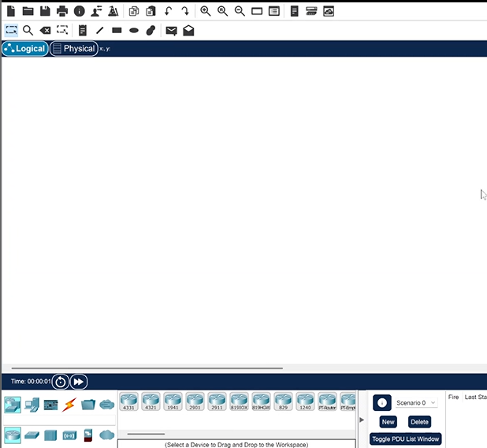
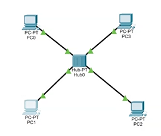
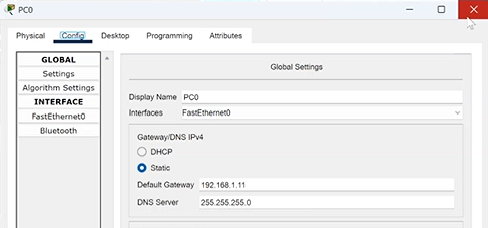
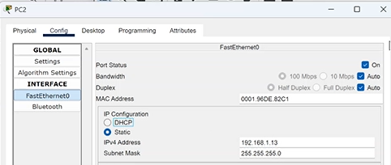
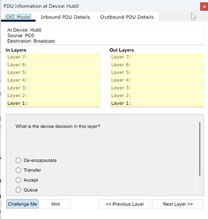
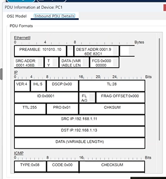
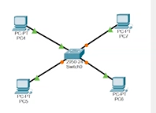
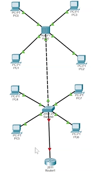

---
## Front matter
title: "Отчет по лабораторной работе №1"
subtitle: "Дисциплина: Администрирование локальных сетей"
author: "Доберштейн Алина Сергеевна"

## Bibliography
bibliography: bib/cite.bib
csl: pandoc/csl/gost-r-7-0-5-2008-numeric.csl

## Pdf output format
toc: true # Table of contents
toc-depth: 2
lof: true # List of figures
lot: true # List of tables
fontsize: 12pt
linestretch: 1.5
papersize: a4
documentclass: scrreprt
## I18n polyglossia
polyglossia-lang:
  name: russian
  options:
	- spelling=modern
	- babelshorthands=true
polyglossia-otherlangs:
  name: english
## I18n babel
babel-lang: russian
babel-otherlangs: english
## Fonts
mainfont: PT Serif
romanfont: PT Serif
sansfont: PT Sans
monofont: PT Mono
mainfontoptions: Ligatures=TeX
romanfontoptions: Ligatures=TeX
sansfontoptions: Ligatures=TeX,Scale=MatchLowercase
monofontoptions: Scale=MatchLowercase,Scale=0.9
## Biblatex
biblatex: true
biblio-style: "gost-numeric"
biblatexoptions:
  - parentracker=true
  - backend=biber
  - hyperref=auto
  - language=auto
  - autolang=other*
  - citestyle=gost-numeric
## Pandoc-crossref LaTeX customization
figureTitle: "Рис."
tableTitle: "Таблица"
listingTitle: "Листинг"
lofTitle: "Список иллюстраций"
lotTitle: "Список таблиц"
lolTitle: "Листинги"
## Misc options
indent: true
header-includes:
  - \usepackage{indentfirst}
  - \usepackage{float} # keep figures where there are in the text
  - \floatplacement{figure}{H} # keep figures where there are in the text
---

# Цель работы

Установка инструмента моделирования конфигурации сети Cisco Packet Tracer, знакомство с его интерфейсом.

# Задание

1. Установить на домашнем устройстве Cisco Packet Tracer.
2. Постройте простейшую сеть в Cisco Packet Tracer, проведите простейшую настройку оборудования.

# Выполнение лабораторной работы

1. Установила в своей ОС Cisco Packet Tracer и заблокировала для него доступ в интернет. (рис. @fig:001).

{#fig:001 width=70%}

2. Создала новый проект. В рабочем пространстве разместила концентратор (Hub-PT) и четыре оконечный устройства PC. Соединила оконечные устройства с концентратором прямым кабелем. Задала статические IP-адреса 192.168.1.11, 192.168.1.12, 192.168.1.13, 192.168.1.14 с маской подсети 255.255.255.0. (рис. @fig:002-@fig:005).

{#fig:002 width=70%}

{#fig:003 width=70%}

{#fig:004 width=70%}

3. В основном окне проекта перешла из режима Realtime в режим Simulation. Выбрала на панели инструментов мышкой "Add simple PDU (P)" и щелкнула сначаоа на РС0, затем на РС2. На панели моделирования нажала кнопку «Play» и проследила за движением пакетов ARP и ICMP от устройства PC0 до устройства PC2 и обратно.

4. Щелкнув на строке события, открыла окно информации о PDU, изучила, что просиходит на уровне модели OSI при перемещении пакета. PC0 отправляет пакет на концентратор, тот пересылает его на все оконечные устройства, но только PC2, которому и был предназначен пакет, принимает его. Используя кнопку «Проверь себя» на вкладке OSI Model, ответила на вопросы. (рис. @fig:008).

{#fig:008 width=70%}

5. Открыла вкладку с информацией о PDU. Исследовала структуру пакета ICMP. Структура включает в себя тип пакета, код, контрольную сумму, идентификатор и порядковый номер. Описала структуру кадра Ethernet: преамбула, SDF, адрес назначения, адрес источника, тип, данные и контрольная последовательность кадра. Описала структуру MAC-адресов. MAC-адрес состоит из 6 байтов (12 символов), первые 3 байта (6 символов) определяют код производителя (в нашем случае, Cisco), остальные - идентификатор. (рис. @fig:009).

{#fig:009 width=70%}

6. Очистила список событий, удалив сценарий моделирования. Выбрала на панели инструментов мышкой "Add simple PDU", щелкнула сначала на РС0, затем на РС2. Снова выбрала на панели инструментов мышкой "Add simple PDU" и щелкнула сначала на РС2, затем на РС0. На панели моделирования нажала кнопку «Play» и проследила за возникновением коллизии. В списке событий посмотрела информацию о PDU. Коллизия возникает, когда оба пакета передаются на концентратор, поскольку он не может передавать несколько сообщений параллельно, далее один из пакетов пропадает, а другой передается дальше, но возникает ошибка.

7. Перешла в режим реального времени (Realtime). В рабочем пространстве разместила коммутатор (Cisco 2950-24) и 4 оконечных устройства PC. Соединила оконечные устройства с коммутатором прямым кабелем. Щёлкнув последовательно на каждом оконечном устройстве, задала статические IP-адреса 192.168.1.21, 192.168.1.22, 192.168.1.23, 192.168.1.24 с маской подсети 255.255.255.0. (рис. @fig:012).

{#fig:012 width=70%}

8. В основном окне проекта перешла из режима реального времени (Realtime) в режим моделирования (Simulation). Выбрала на панели инструментов мышкой «Add Simple PDU (P)» и щёлкнула сначала на PC4, затем на PC6. На панели моделирования нажала кнопку «Play» и проследила за движением пакетов ARP и ICMP от устройства PC4 до устройства PC6 и обратно. Есть различия в событиях протокола ARP в сценарии с концентратором. Если концентратор просто пересылает пакет на все подключенные к нему устройства каждый раз, то коммутатор один раз рассылает на все устройства и запоминает какое устройство приняло пакет (то есть адрес этого устройства совпал с адресом назначения пакета) и вносит его адрес в таблицу, в дальнейшем использует эту информацию, чтобы напрямую пересылать пакет нужному устройству.

9. Очистила список событий, удалив сценарий моделирования. Выбрала на панели инструментов мышкой «Add Simple PDU (P)» и щёлкнула сначала на PC4, затем на PC6. Снова выбрала на панели инструментов мышкой «Add Simple PDU (P)» и щёлкнула сначала на PC6, затем на PC4. На панели моделирования нажала кнопку «Play» и проследила за движением пакетов. Коллизия не возникает потому, что пакет не рассылается всем устройствам, а передается по нужным адресам коммутатором.

{#fig:019 width=70%}

10.  Перешла в режим реального времени (Realtime). В рабочем пространстве соединила кроссовым кабелем концентратор и коммутатор. Перешла в режим моделирования (Simulation). Очистила список событий, удалив сценарий моделирования. Выбрала на панели инструментов мышкой «Add Simple PDU (P)» и щёлкнула сначала на PC0, затем на PC4. Снова выбрала на панели инструментов мышкой «Add Simple PDU (P)» и щёлкнула сначала на PC4, затем на PC0. На панели моделирования нажала кнопку «Play» и проследила за движением пакетов. Когда коллизия возникает, пакет, отправленный из сети с концентратором исчезает, а пакет из сети с коммутатором достигает адреса назначения, поскольку коммутатор может работать в режиме полного дуплекса.

11.   Очистила список событий, удалив сценарий моделирования. На панели моделирования нажала "Play" и в списке событий получила пакеты STP. Исследовала структуру STP. Пакет включает в себя идентификатор протокола, версию, тип, флаги, идентификатор корневого моста, расстояние до корневого моста, идентификатор моста, идентификатор порта, время жизни сообщения, максимальное время жизни сообщения, время приветствия и задержку смены состояния.(рис. @fig:021).

{#fig:021 width=70%}

12. Перешла в режим реального времени. В рабочем пространстве добавила маршрутизатор (Cisco 2811). Соединила прямым кабелем коммутатор и маршрутизатор. Щёлкнула на маршрутизаторе и на вкладке его конфигурации прописала статический IP-адрес 192.168.1.254 с маской 255.255.255.0, активировала порт, поставив галочку «On» напротив «Port Status».(рис. @fig:023).

{#fig:023 width=70%}

13.   Перешла в режим моделирования (Simulation). Очистила список событий, удалив сценарий моделирования. Выбрала на панели инструментов мышкой «Add Simple PDU (P)» и щёлкнула сначала на PC3, затем на маршрутизаторе. На панели моделирования нажала кнопку «Play» и проследила за движением пакетов ARP, ICMP, STP и CDP. Исследовала структуру пакета CDP. Она включает в себя поле версии протокола, поле Time-to-Live (время жизни), контрольную сумму, тип, поле длины, поле значения, содержащее (в зависимости от параметра Type) тип протокола, длину поля протокола, длину прня адреса и адрес интерфейса.
    
# Контрольные вопросы

1.	Дайте определение следующим понятиям: концентратор, коммутатор, маршрутизатор, шлюз (gateway). В каких случаях следует использовать тот или иной тип сетевого оборудования?

Концентратор - пассивное сетевое устройство, которое передает полученный сигнал на все подключенные порты. Не осуществляет интеллектуальной обработки данных, просто ретранслирует их. Все устройства на концентраторе работают в одной коллизионной области (при столкновении пакетов происходит потеря данных).
Когда использовать: В очень небольших сетях (2-3 устройства) или в качестве временного решения. Сейчас практически не используется из-за низкой эффективности и производительности.

Коммутатор – активное сетевое устройство, которое пересылает данные только на тот порт, которому они предназначены, используя MAC-адреса. Избегает коллизий, значительно повышая производительность сети.
Когда использовать: В большинстве локальных сетей (LAN) любого размера. Обеспечивает более высокую скорость и надежность передачи данных по сравнению с концентратором.

Маршрутизатор – активное сетевое устройство, которое направляет пакеты данных между различными сетями (например, между LAN и WAN, или между двумя LAN с различными подсетями). Использует IP-адреса для определения пути передачи данных. Может выполнять функции NAT (Network Address Translation), фильтрации пакетов и другие функции безопасности.
Когда использовать: Для соединения различных сетей, для организации доступа в Интернет, для построения сложных сетевых инфраструктур, для обеспечения безопасности сети.

Шлюз (Gateway) – устройство или программное обеспечение, которое обеспечивает связь между двумя различными сетями с несовместимыми протоколами. Это может быть маршрутизатор с дополнительными функциями преобразования протоколов, или специальный сервер.
Когда использовать: Для связи между сетями с различными протоколами (например, между сетью TCP/IP и сетью IPX), для доступа к ресурсам другой сети с использованием различных протоколов.

2.	Дайте определение следующим понятиям: ip-адрес, сетевая маска, broadcast-адрес. 

IP-адрес – уникальный 32-битный (IPv4) или 128-битный (IPv6) числовой идентификатор, который назначается каждому устройству в компьютерной сети, использующей протокол IP. Позволяет устройствам обмениваться данными друг с другом.
Сетевая маска – 32-битное число, которое определяет, какая часть IP-адреса относится к сети, а какая — к узлу в сети. Используется для разделения IP-адресного пространства на подсети.
Broadcast-адрес – специальный IP-адрес, который используется для отправки сообщений всем устройствам в одной подсети.

3.	Как можно проверить доступность узла сети?

Ping: Утилита командной строки, которая отправляет ICMP-эхо-запросы к указанному IP-адресу или имени узла. Если узел доступен, он отвечает.
Traceroute (tracert): Утилита, которая отслеживает путь пакета данных от источника к целевому узлу, показывая все промежуточные маршрутизаторы. Позволяет определить, на каком этапе происходит сбой связи.
Telnet/SSH: Позволяют подключиться к удаленному устройству и проверить его работоспособность.

# Выводы

Я установила инструмент моделирования конфигурации сети Cisco Packet Tracer и познакомилась с его интерфейсом. 

::: {#refs}
:::
