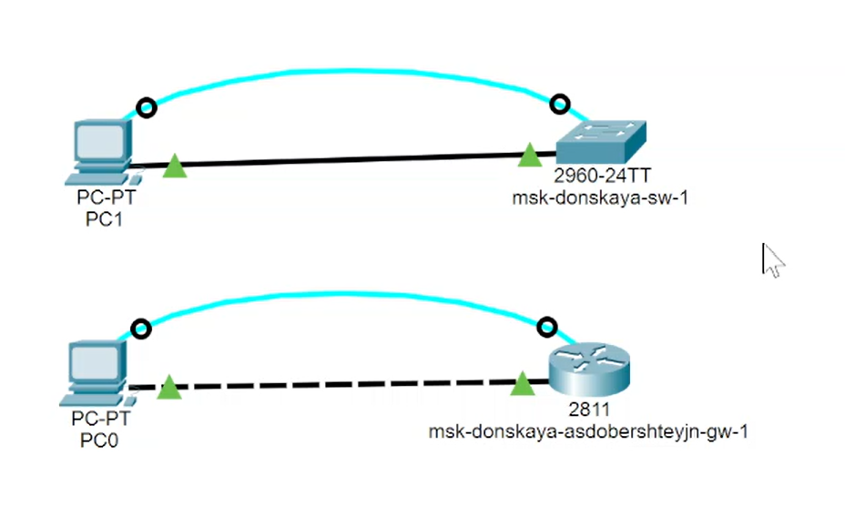
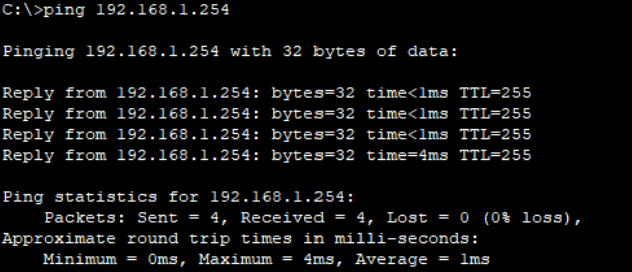
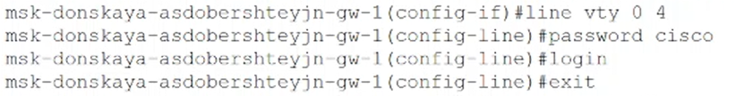
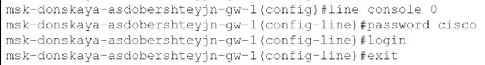
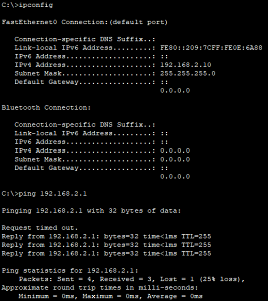
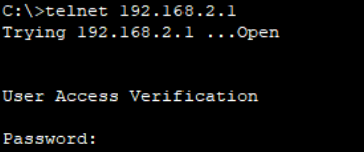
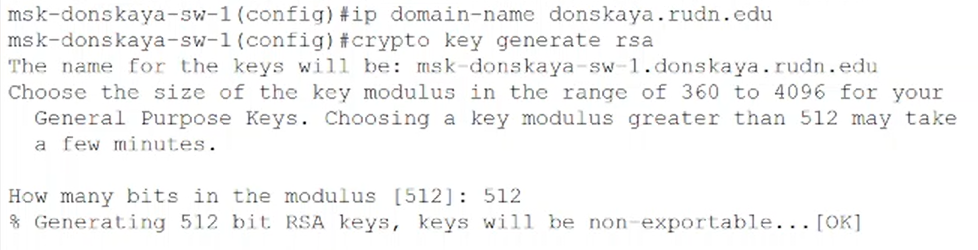

---
## Front matter
lang: ru-RU
title: "Презентация по лабораторной работе №2"
subtitle: "Дисциплина: Администрирование локальных сетей"
author:
  - Доберштейн А.C.
institute:
  - Российский университет дружбы народов, Москва, Россия
date: 04 апреля 2025

## i18n babel
babel-lang: russian
babel-otherlangs: english

## Formatting pdf
toc: false
toc-title: Содержание
slide_level: 2
aspectratio: 169
section-titles: true
theme: metropolis
header-includes:
 - \metroset{progressbar=frametitle,sectionpage=progressbar,numbering=fraction}
 - '\makeatletter'
 - '\beamer@ignorenonframefalse'
 - '\makeatother'
---

# Информация

## Докладчик

  * Доберштейн Алина Сергеевна
  * 1132226448
  * НФИбд-02-22

# Цель работы

Получить основные навыки по начальному конфигурированию оборудования Cisco.

# Задание

1. Сделать предварительную настройку маршрутизатора:

– задать имя в виде «город-территория-учётная_записьтип_оборудования-номер»;

– задать интерфейсу Fast Ethernet с номером 0 ip-адрес 192.168.1.254 и маску 255.255.255.0, затем поднять интерфейс;

– задать пароль для доступа к привилегированному режиму (сначала в открытом виде, затем — в зашифрованном);

– настроить доступ к оборудованию сначала через telnet, затем — через ssh;

– сохранить и экспортировать конфигурацию в отдельный файл.

##

2. Сделать предварительную настройку коммутатора:

– задать имя в виде «город-территория-учётная_записьтип_оборудования-номер»;

– задать интерфейсу vlan 2 ip-адрес 192.168.2.1 и маску 255.255.255.0, затем поднять интерфейс;

– привязать интерфейс Fast Ethernet с номером 1 к vlan 2;

– задать в качестве адреса шлюза по умолчанию адрес 192.168.2.254;

– задать пароль для доступа к привилегированному режиму (сначала в открытом виде, затем — в зашифрованном);

– настроить доступ к оборудованию сначала через telnet, затем — через ssh;

– для пользователя admin задать доступ 1-го уровня по паролю;

– сохранить и экспортировать конфигурацию в отдельный файл.

# Выполнение лабораторной работы

##

В логической рабочей области Packet Tracer разместила коммутатор, маршрутизатор и 2 оконечных устройства типа PC, соединила один PC с маршрутизатором, другой PC — с коммутатором. (рис. @fig:001).

{#fig:001 width=70%}

##

Провела настройку маршрутизатора в соответствии с заданием. Задала имя в виде "город-территория-учетная_запись-тип_оборудования-номер". (рис. @fig:002).

{#fig:002 width=70%}

##

Задала интерфейсу Fast Ethernet с номером 0 ip-адрес 192.168.1.254 и маску 255.255.255.0, затем подняла интерфейс.(рис. @fig:003).

{#fig:003 width=70%}

##

Проверила работоспособность соединений с помощью команды ping. (рис. @fig:004).

{#fig:004 width=70%}

##

Задала пароль для доступа к привилегированному режиму (сначала в открытом виде, затем — в зашифрованном). (рис. @fig:005).

{#fig:005 width=70%}

{#fig:006 width=70%}

{#fig:007 width=70%}

##

Настроила доступ к оборудованию через telnet. (рис. @fig:008).

{#fig:008 width=70%}

##

Для пользователя admin задала доступ 1-го уровня по паролю.(рис. @fig:009).

{#fig:009 width=70%}

##

Настроила доступ к оборудованию через ssh. (рис. @fig:010).

{#fig:010 width=70%}

{#fig:011 width=70%}

##

Сохранила и экспортировала конфигурацию в отдельный файл. Затем провела настройку коммутатора. Задала имя в виде «город-территория-учётная_записьтип_оборудования-номер». Далее задала интерфейсу vlan 2 ip-адрес 192.168.2.1 и маску 255.255.255.0, затем подняла интерфейс. (рис. @fig:012).

{#fig:012 width=70%}

##

Привязала интерфейс Fast Ethernet с номером 1 к vlan 2.(рис. @fig:013).

{#fig:013 width=70%}

##

Задала в качестве адреса шлюза по умолчанию адрес 192.168.2.254. (рис. @fig:014).

{#fig:014 width=70%}

##

Проверила работоспособность соединений с помощью команды ping.(рис. @fig:015).

{#fig:015 width=30%}

##

Задала пароль для доступа к привелегированному режиму сначала в открытом виде, потом в зашифрованном. (рис. @fig:016).

{#fig:016 width=70%}

{#fig:017 width=70%}

{#fig:018 width=70%}

##

Настроила доступ к оборудованию через telnet. (рис. @fig:019).

{#fig:019 width=70%}

##

Для пользователя admin задала доступ 1-го уровня по паролю.(рис. @fig:020).

{#fig:020 width=70%}

##

Настроила доступ к оборудованию через ssh. (рис. @fig:021).

{#fig:021 width=70%}

{#fig:022 width=70%}

##

Cохранила и экспортировала конфигурацию в отдельный файл. 

# Выводы

Я получила основные навыки по начальному конфигурированию оборудования Cisco. 
