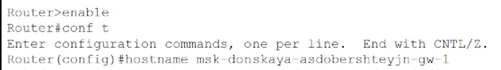
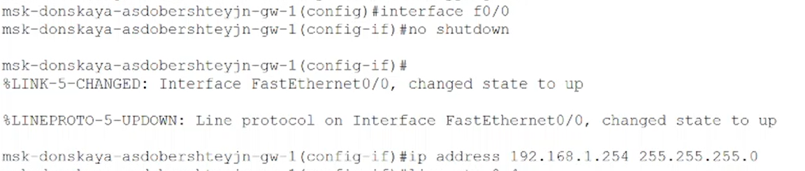
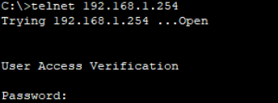
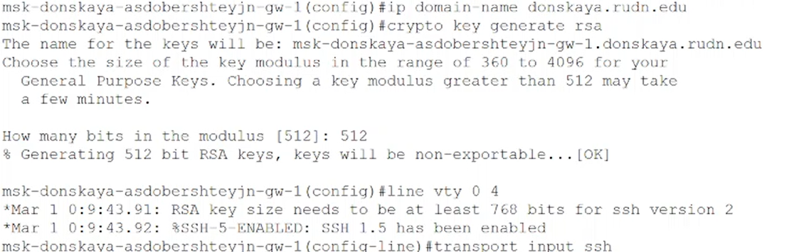
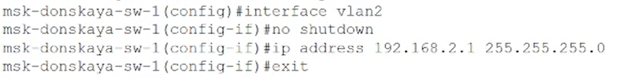
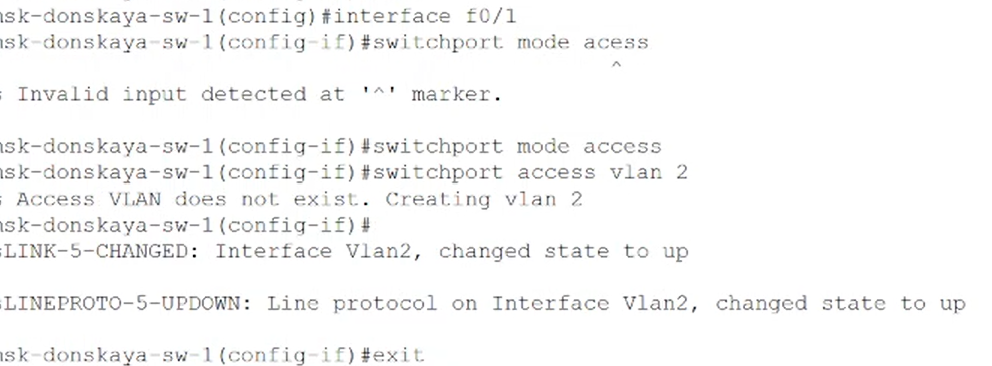
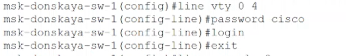
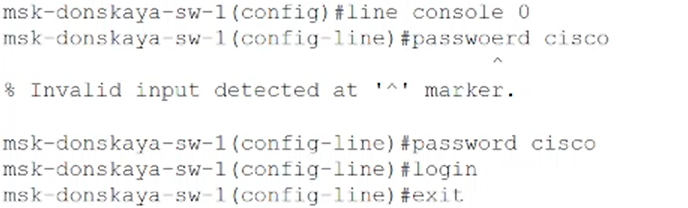

---
## Front matter
title: "Отчет по лабораторной работе №2"
subtitle: "Дисциплина: Администрирование локальных сетей"
author: "Доберштейн Алина Сергеевна"

## Bibliography
bibliography: bib/cite.bib
csl: pandoc/csl/gost-r-7-0-5-2008-numeric.csl

## Pdf output format
toc: true # Table of contents
toc-depth: 2
lof: true # List of figures
lot: true # List of tables
fontsize: 12pt
linestretch: 1.5
papersize: a4
documentclass: scrreprt
## I18n polyglossia
polyglossia-lang:
  name: russian
  options:
	- spelling=modern
	- babelshorthands=true
polyglossia-otherlangs:
  name: english
## I18n babel
babel-lang: russian
babel-otherlangs: english
## Fonts
mainfont: PT Serif
romanfont: PT Serif
sansfont: PT Sans
monofont: PT Mono
mainfontoptions: Ligatures=TeX
romanfontoptions: Ligatures=TeX
sansfontoptions: Ligatures=TeX,Scale=MatchLowercase
monofontoptions: Scale=MatchLowercase,Scale=0.9
## Biblatex
biblatex: true
biblio-style: "gost-numeric"
biblatexoptions:
  - parentracker=true
  - backend=biber
  - hyperref=auto
  - language=auto
  - autolang=other*
  - citestyle=gost-numeric
## Pandoc-crossref LaTeX customization
figureTitle: "Рис."
tableTitle: "Таблица"
listingTitle: "Листинг"
lofTitle: "Список иллюстраций"
lotTitle: "Список таблиц"
lolTitle: "Листинги"
## Misc options
indent: true
header-includes:
  - \usepackage{indentfirst}
  - \usepackage{float} # keep figures where there are in the text
  - \floatplacement{figure}{H} # keep figures where there are in the text
---

# Цель работы

Получить основные навыки по начальному конфигурированию оборудования Cisco.

# Задание

1. Сделать предварительную настройку маршрутизатора:

– задать имя в виде «город-территория-учётная_записьтип_оборудования-номер»;

– задать интерфейсу Fast Ethernet с номером 0 ip-адрес 192.168.1.254 и маску 255.255.255.0, затем поднять интерфейс;

– задать пароль для доступа к привилегированному режиму (сначала в открытом виде, затем — в зашифрованном);

– настроить доступ к оборудованию сначала через telnet, затем — через ssh;

– сохранить и экспортировать конфигурацию в отдельный файл.

2. Сделать предварительную настройку коммутатора:

– задать имя в виде «город-территория-учётная_записьтип_оборудования-номер»;

– задать интерфейсу vlan 2 ip-адрес 192.168.2.1 и маску 255.255.255.0, затем поднять интерфейс;

– привязать интерфейс Fast Ethernet с номером 1 к vlan 2;

– задать в качестве адреса шлюза по умолчанию адрес 192.168.2.254;

– задать пароль для доступа к привилегированному режиму (сначала в открытом виде, затем — в зашифрованном);

– настроить доступ к оборудованию сначала через telnet, затем — через ssh;

– для пользователя admin задать доступ 1-го уровня по паролю;

– сохранить и экспортировать конфигурацию в отдельный файл.

# Выполнение лабораторной работы

1. В логической рабочей области Packet Tracer разместила коммутатор, маршрутизатор и 2 оконечных устройства типа PC, соединила один PC с маршрутизатором, другой PC — с коммутатором. (рис. @fig:001).

{#fig:001 width=70%}

2. Провела настройку маршрутизатора в соответствии с заданием. Задала имя в виде "город-территория-учетная_запись-тип_оборудования-номер". (рис. @fig:002).

{#fig:002 width=70%}

3. Задала интерфейсу Fast Ethernet с номером 0 ip-адрес 192.168.1.254 и маску 255.255.255.0, затем подняла интерфейс.(рис. @fig:003).

{#fig:003 width=70%}

4. Проверила работоспособность соединений с помощью команды ping. (рис. @fig:004).

{#fig:004 width=70%}

5. Задала пароль для доступа к привилегированному режиму (сначала в открытом виде, затем — в зашифрованном). (рис. @fig:005).

{#fig:005 width=70%}

{#fig:006 width=70%}

{#fig:007 width=70%}

6. Настроила доступ к оборудованию через telnet. (рис. @fig:008).

{#fig:008 width=70%}

6. Для пользователя admin задала доступ 1-го уровня по паролю.(рис. @fig:009).

{#fig:009 width=70%}

7. Настроила доступ к оборудованию через ssh. (рис. @fig:010).

{#fig:010 width=70%}

{#fig:011 width=70%}

8. Сохранила и экспортировала конфигурацию в отдельный файл.

9. Провела настройку коммутатора. Задала имя в виде «город-территория-учётная_записьтип_оборудования-номер».

10. Задала интерфейсу vlan 2 ip-адрес 192.168.2.1 и маску 255.255.255.0, затем подняла интерфейс. (рис. @fig:012).

{#fig:012 width=70%}

11. Привязала интерфейс Fast Ethernet с номером 1 к vlan 2.(рис. @fig:013).

{#fig:013 width=70%}

12. Задала в качестве адреса шлюза по умолчанию адрес 192ю168ю2ю254. (рис. @fig:014).

{#fig:014 width=70%}

13. Проверила работоспособность соединений с помощью команды ping.(рис. @fig:015).

{#fig:015 width=70%}

14. Задала пароль для доступа к привелегированному режиму сначала в открытом виде, потом в зашифрованном. (рис. @fig:016).

{#fig:016 width=70%}

{#fig:017 width=70%}

{#fig:018 width=70%}

15. Настроила доступ к оборудованию через telnet. (рис. @fig:019).

{#fig:019 width=70%}

16. Для пользователя admin задала доступ 1-го уровня по паролю.(рис. @fig:020).

{#fig:020 width=70%}

17. Настроила доступ к оборудованию через ssh. (рис. @fig:021).

{#fig:021 width=70%}

{#fig:022 width=70%}

18. Cохранила и экспортировала конфигурацию в отдельный файл. 
 
# Выводы

Я получила основные навыки по начальному конфигурированию оборудования Cisco. 

::: {#refs}
:::
