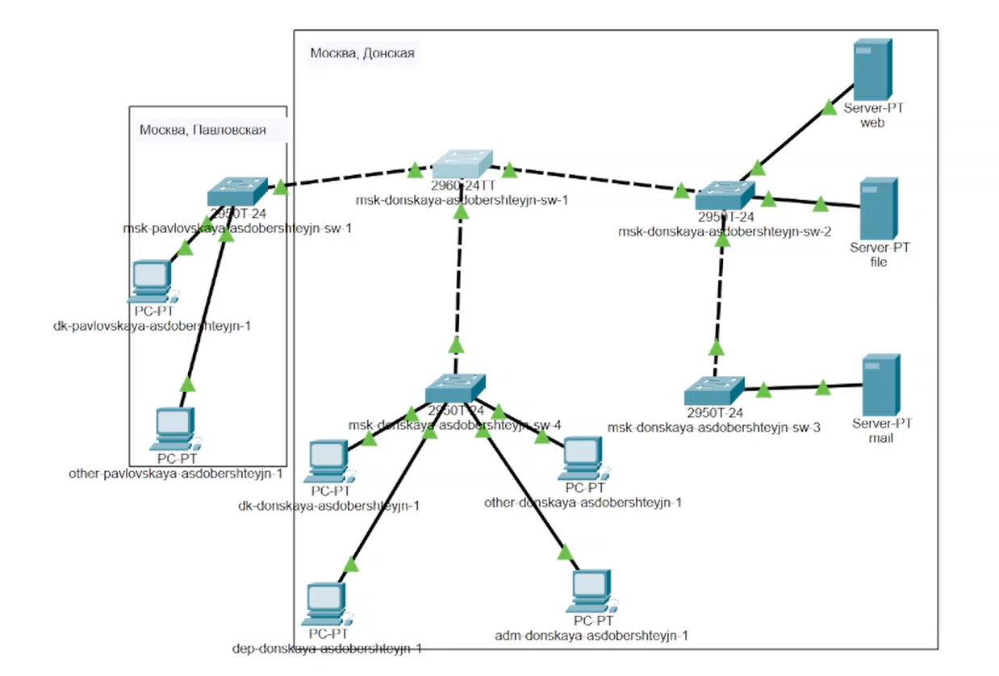
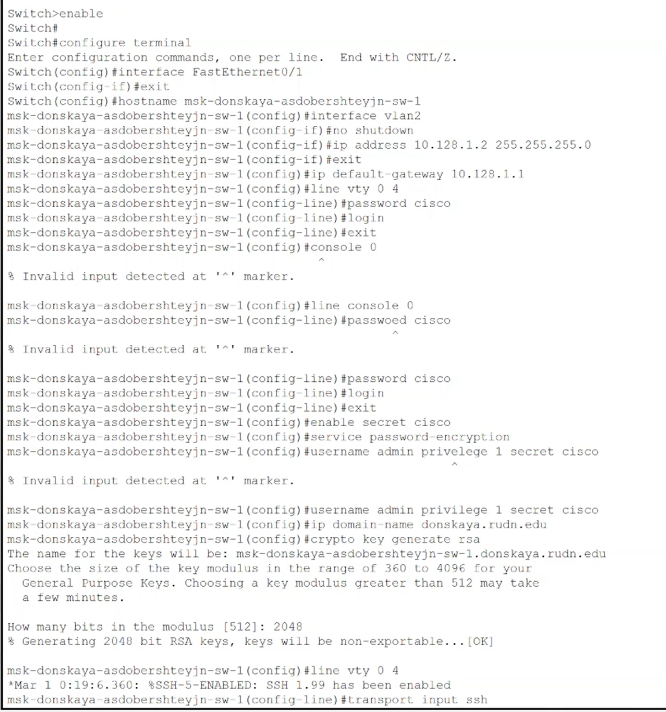
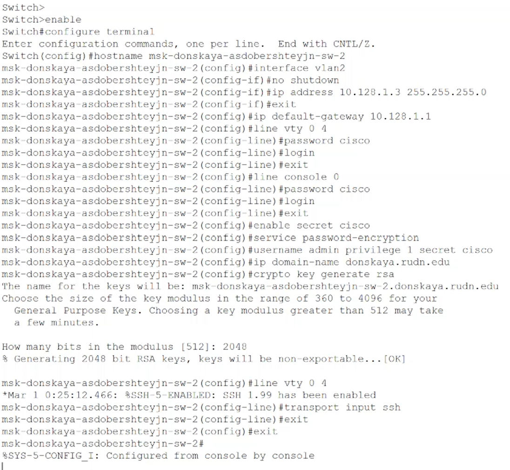
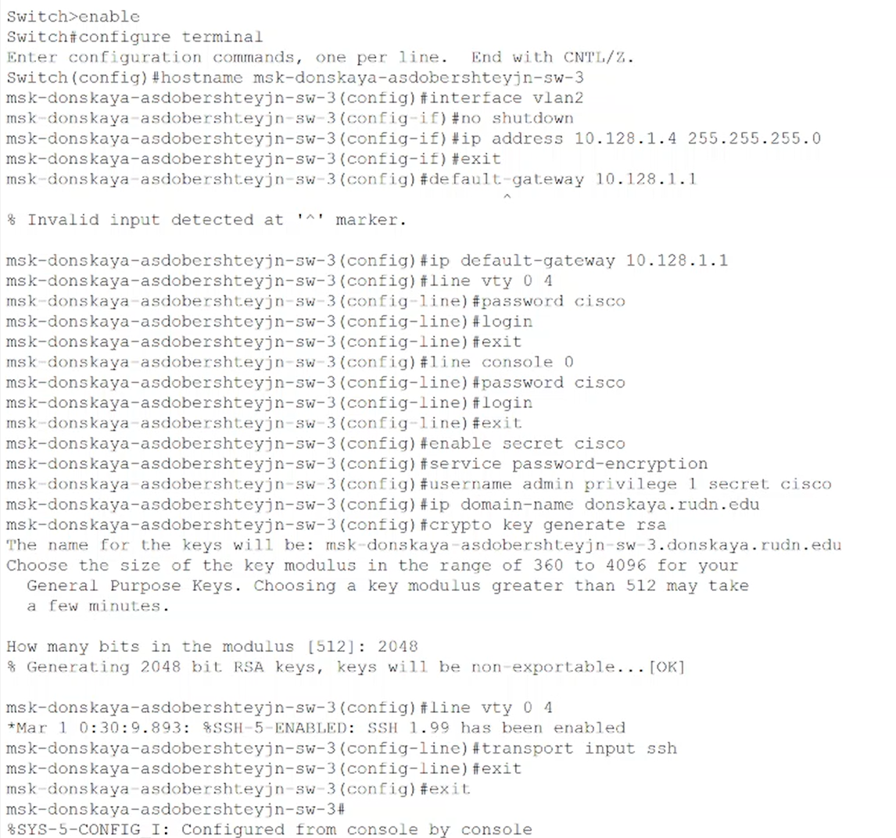
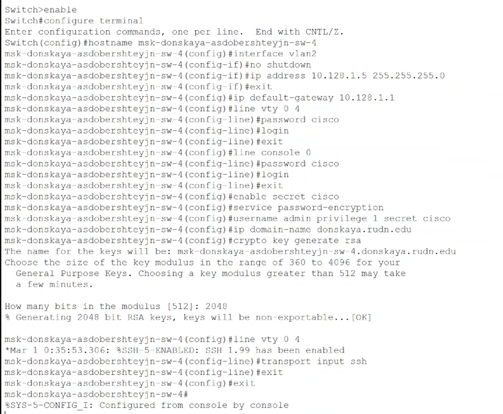
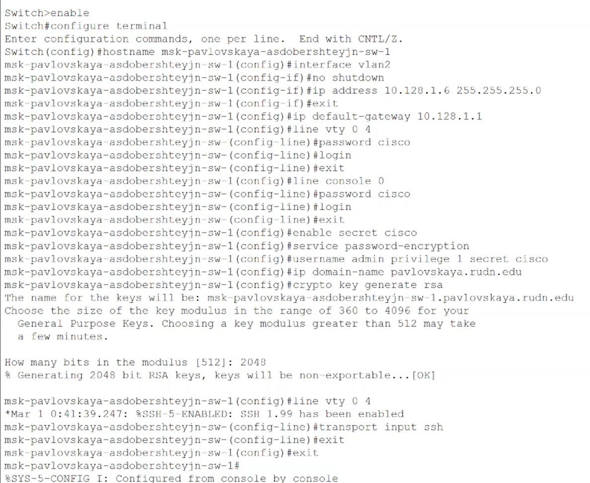

---
## Front matter
lang: ru-RU
title: "Презентация по лабораторной работе №4"
subtitle: "Дисциплина: Администрирование локальных сетей"
author:
  - Доберштейн А.C.
institute:
  - Российский университет дружбы народов, Москва, Россия
date: 04 апреля 2025

## i18n babel
babel-lang: russian
babel-otherlangs: english

## Formatting pdf
toc: false
toc-title: Содержание
slide_level: 2
aspectratio: 169
section-titles: true
theme: metropolis
header-includes:
 - \metroset{progressbar=frametitle,sectionpage=progressbar,numbering=fraction}
 - '\makeatletter'
 - '\beamer@ignorenonframefalse'
 - '\makeatother'
---

# Информация

## Докладчик

  * Доберштейн Алина Сергеевна
  * 1132226448
  * НФИбд-02-22

# Цель работы

Провести подготовительную работу по первоначальной настройке коммутаторов сети.

# Задание

Требуется сделать первоначальную настройку коммутаторов сети, представленной на схеме L1 (см. рис. 3.1 из раздела 3.3). Под первоначальной настройкой понимается указание имени устройства, его IP-адреса, настройка доступа по паролю к виртуальным терминалам и консоли, настройка удалённого доступа к устройству по ssh. При выполнении работы необходимо учитывать соглашение об именовании.

# Выполнение лабораторной работы

##

В логической рабочей области разместила коммутаторы и оконечные устойства согласно схеме сети L1 и соединила их через соответствующие интерфейсы (рис. @fig:001).

{#fig:001 width=70%}

##

Используя типовую конфигурацию коммутатора, настроила все коммутаторы, изменяя название устройства и его IP-адрес согласно плану IP. (рис. @fig:002).

{#fig:002 width=40%}

##

{#fig:003 width=70%}

##

{#fig:004 width=70%}

##

{#fig:005 width=70%}

##

{#fig:006 width=70%}

# Выводы

Я провела подготовительную работу по первоначальной настройке коммутаторов сети.
