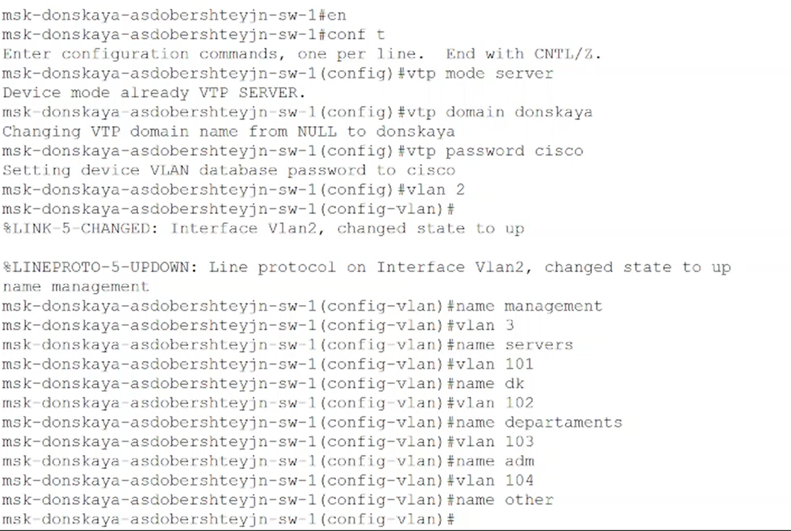
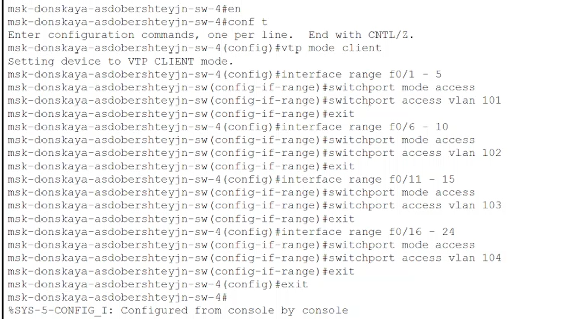
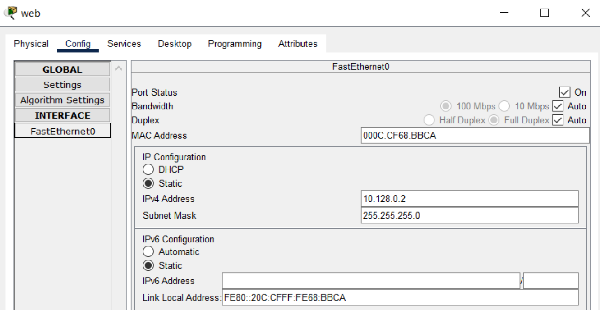
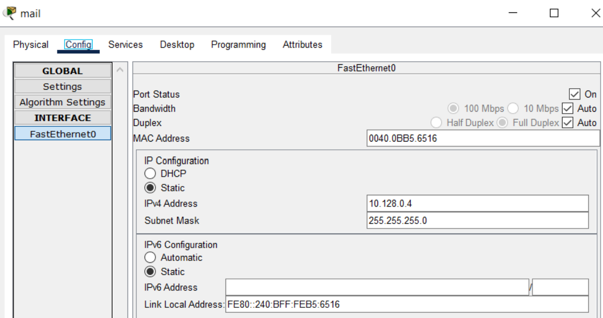
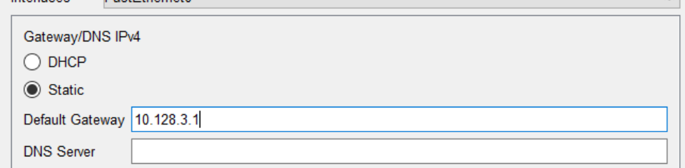
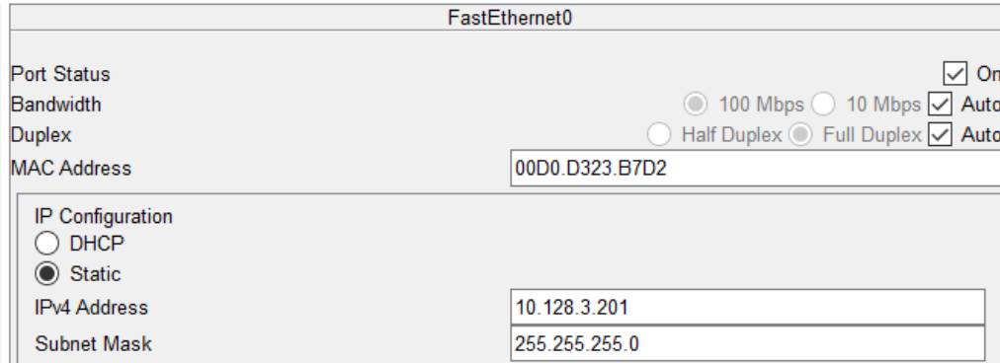
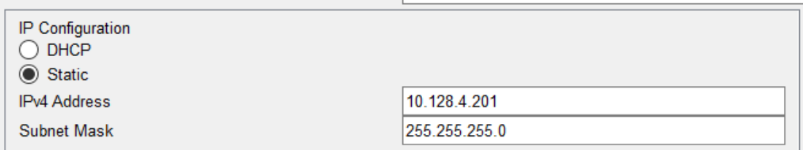
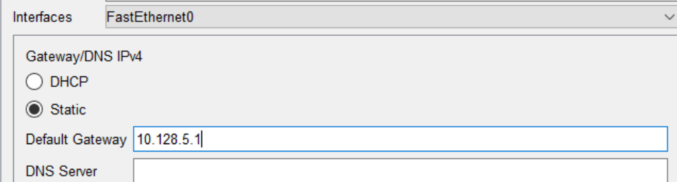
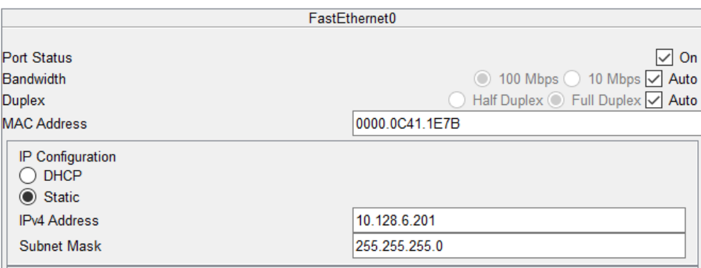

---
## Front matter
lang: ru-RU
title: "Презентация по лабораторной работе №5"
subtitle: "Дисциплина: Администрирование локальных сетей"
author:
  - Доберштейн А.C.
institute:
  - Российский университет дружбы народов, Москва, Россия
date: 04 апреля 2025

## i18n babel
babel-lang: russian
babel-otherlangs: english

## Formatting pdf
toc: false
toc-title: Содержание
slide_level: 2
aspectratio: 169
section-titles: true
theme: metropolis
header-includes:
 - \metroset{progressbar=frametitle,sectionpage=progressbar,numbering=fraction}
 - '\makeatletter'
 - '\beamer@ignorenonframefalse'
 - '\makeatother'
---

# Информация

## Докладчик

  * Доберштейн Алина Сергеевна
  * 1132226448
  * НФИбд-02-22

# Цель работы

Получить основные навыки по настройке VLAN на коммутаторах сети.

# Задание

1. На коммутаторах сети настроить Trunk-порты на соответствующих интерфейсах, связывающих коммутаторы между
собой.

2. Коммутатор msk-donskaya-sw-1 настроить как VTP-сервер и прописать на нём номера и названия VLAN согласно табл. 3.1 из раздела 3.3.

3. Коммутаторы msk-donskaya-sw-2 — msk-donskaya-sw-4, mskpavlovskaya-sw-1 настроить как VTP-клиенты, на интерфейсах указать принадлежность к соответствующему VLAN.

4. На серверах прописать IP-адреса, как указано в табл. 3.2 из раздела 3.3.

##

5. На оконечных устройствах указать соответствующий адрес шлюза и прописать статические IP-адреса из диапазона соответствующей сети, следуя регламенту выделения ip-адресов.

6. Проверить доступность устройств, принадлежащих одному VLAN, и недоступность устройств, принадлежащих разным VLAN.

7. При выполнении работы необходимо учитывать соглашение об именовании.

# Выполнение лабораторной работы

##

Используя приведенную ниже последовательность команд, настроила trunk порты на соответствующих интерфейсах всех коммутаторов. (рис. @fig:001).

{#fig:001 width=50%}

##

{#fig:002 width=70%}

{#fig:003 width=70%}

##

{#fig:004 width=70%}

{#fig:005 width=70%}

##

Используя приведенную ниже последовательность команд по конфигурации VTP, настроила коммутатор msk-donskaya-sw-1 как VTP-сервер и прописала на нем номера и названия VLAN. (рис. @fig:006).

{#fig:006 width=50%}

##

Используя приведенную ниже последовательность команд по конфигурации диапазонов портов, настроила коммутаторы msk-donskaya-sw-2 - msk-donskaya-sw-4, msk-pavlovskaya-sw-1 как VTP-клиенты и на интерфейсах указала принадлежность к VLAN.(рис. @fig:007).

{#fig:007 width=70%}

##

{#fig:008 width=70%}

##

{#fig:009 width=70%}

##

{#fig:010 width=70%}

##

Указала статические IP-адреса на оконечных устройствах и серверах. (рис. @fig:011).

{#fig:011 width=70%}

##

{#fig:012 width=70%}

##

{#fig:013 width=70%}

##

{#fig:014 width=70%}

##

{#fig:015 width=70%}

{#fig:016 width=70%}

##

{#fig:017 width=70%}

{#fig:018 width=70%}

##

{#fig:019 width=70%}

{#fig:020 width=70%}

##

{#fig:021 width=70%}

{#fig:022 width=70%}

##

{#fig:023 width=70%}

{#fig:024 width=70%}

##

{#fig:025 width=70%}

{#fig:026 width=70%}

##

Проверила с помощью команды ping доступность устройств, принадлежащих к одному VLAN и недоступность устройств, принадлежащих разным VLAN.(рис. @fig:027).

{#fig:027 width=70%}

##

Используя режим симуляции, изучила процесс передвижения пакета ICMP по сети. Должна была, но у меня этого пакета не было, к сожалению.

# Выводы

Я получила основные навыки по настройке VLAN на коммутаторах сети.
