---
## Front matter
title: "Отчет по лабораторной работе №5"
subtitle: "Дисциплина: Администрирование локальных сетей"
author: "Доберштейн Алина Сергеевна"

## Bibliography
bibliography: bib/cite.bib
csl: pandoc/csl/gost-r-7-0-5-2008-numeric.csl

## Pdf output format
toc: true # Table of contents
toc-depth: 2
lof: true # List of figures
lot: true # List of tables
fontsize: 12pt
linestretch: 1.5
papersize: a4
documentclass: scrreprt
## I18n polyglossia
polyglossia-lang:
  name: russian
  options:
	- spelling=modern
	- babelshorthands=true
polyglossia-otherlangs:
  name: english
## I18n babel
babel-lang: russian
babel-otherlangs: english
## Fonts
mainfont: PT Serif
romanfont: PT Serif
sansfont: PT Sans
monofont: PT Mono
mainfontoptions: Ligatures=TeX
romanfontoptions: Ligatures=TeX
sansfontoptions: Ligatures=TeX,Scale=MatchLowercase
monofontoptions: Scale=MatchLowercase,Scale=0.9
## Biblatex
biblatex: true
biblio-style: "gost-numeric"
biblatexoptions:
  - parentracker=true
  - backend=biber
  - hyperref=auto
  - language=auto
  - autolang=other*
  - citestyle=gost-numeric
## Pandoc-crossref LaTeX customization
figureTitle: "Рис."
tableTitle: "Таблица"
listingTitle: "Листинг"
lofTitle: "Список иллюстраций"
lotTitle: "Список таблиц"
lolTitle: "Листинги"
## Misc options
indent: true
header-includes:
  - \usepackage{indentfirst}
  - \usepackage{float} # keep figures where there are in the text
  - \floatplacement{figure}{H} # keep figures where there are in the text
---

# Цель работы

Получить основные навыки по настройке VLAN на коммутаторах сети.

# Задание

1. На коммутаторах сети настроить Trunk-порты на соответствующих интерфейсах, связывающих коммутаторы между
собой.

2. Коммутатор msk-donskaya-sw-1 настроить как VTP-сервер и прописать на нём номера и названия VLAN согласно табл. 3.1 из раздела 3.3.

3. Коммутаторы msk-donskaya-sw-2 — msk-donskaya-sw-4, mskpavlovskaya-sw-1 настроить как VTP-клиенты, на интерфейсах указать принадлежность к соответствующему VLAN.

4. На серверах прописать IP-адреса, как указано в табл. 3.2 из раздела 3.3.

5. На оконечных устройствах указать соответствующий адрес шлюза и прописать статические IP-адреса из диапазона соответствующей сети, следуя регламенту выделения ip-адресов.

6. Проверить доступность устройств, принадлежащих одному VLAN, и недоступность устройств, принадлежащих разным VLAN.

7. При выполнении работы необходимо учитывать соглашение об именовании.

# Выполнение лабораторной работы
1. Используя приведенную ниже последовательность команд, настроила trunk порты на соответствующих интерфейсах всех коммутаторов. (рис. @fig:001).

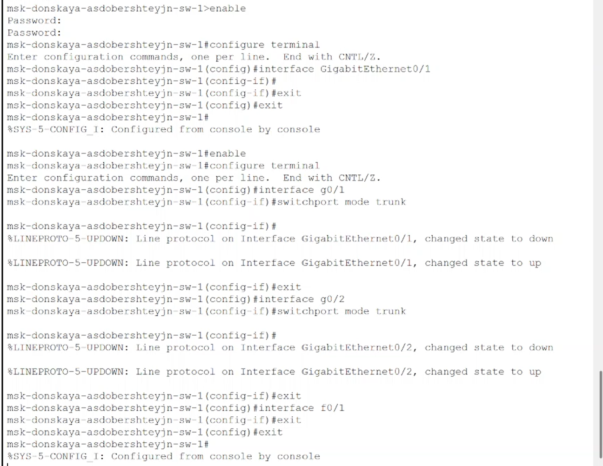{#fig:001 width=70%}

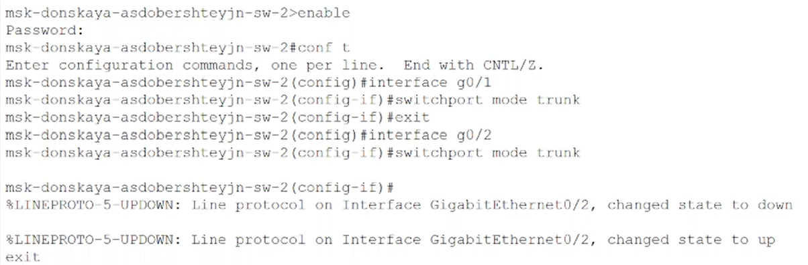{#fig:002 width=70%}

{#fig:003 width=70%}

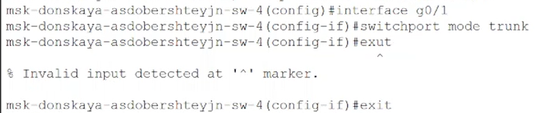{#fig:004 width=70%}

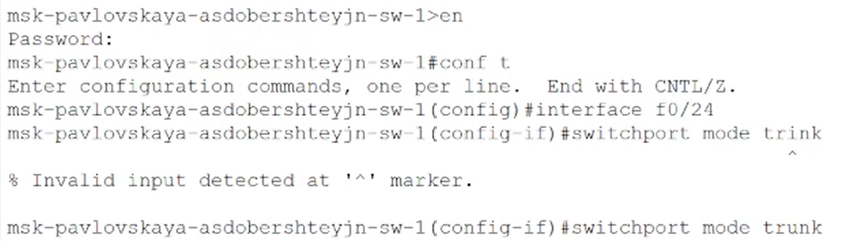{#fig:005 width=70%}

2. Используя приведенную ниже последовательность команд по конфигурации VTP, настроила коммутатор msk-donskaya-sw-1 как VTP-сервер и прописала на нем номера и названия VLAN. (рис. @fig:006).

{#fig:006 width=70%}

3. Используя приведенную ниже последовательность команд по конфигурации диапазонов портов, настроила коммутаторы msk-donskaya-sw-2 - msk-donskaya-sw-4, msk-pavlovskaya-sw-1 как VTP-клиенты и на интерфейсах указала принадлежность к VLAN.(рис. @fig:007).

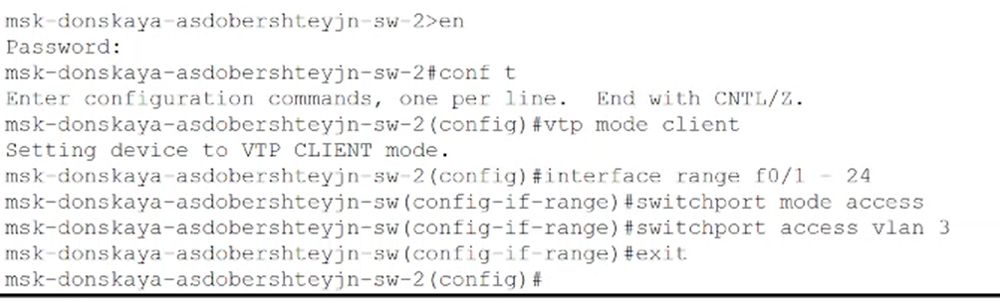{#fig:007 width=70%}

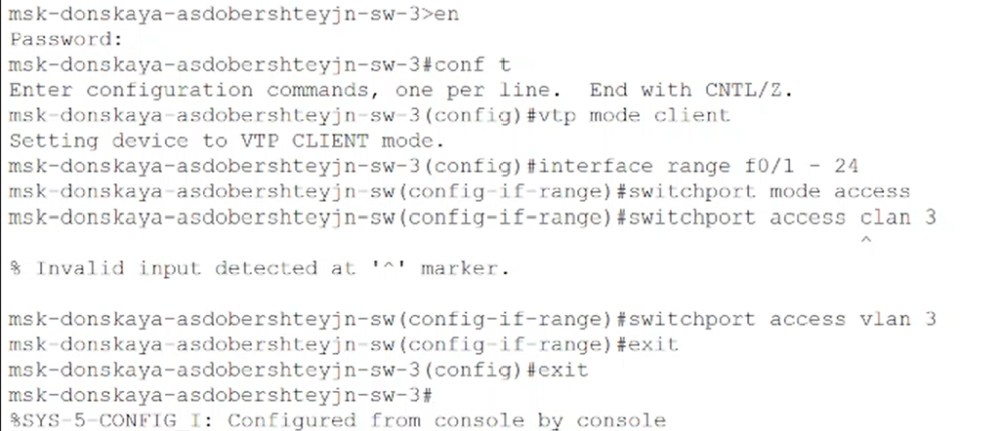{#fig:008 width=70%}

{#fig:009 width=70%}

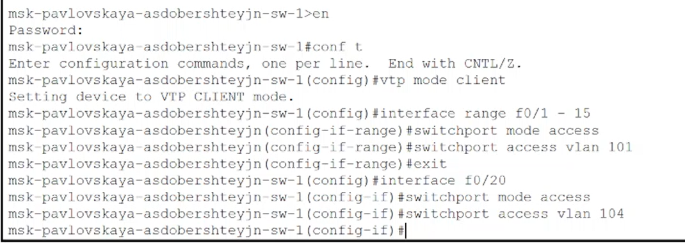{#fig:010 width=70%}

4. Указала статические IP-адреса на оконечных устройствах и серверах. (рис. @fig:011).

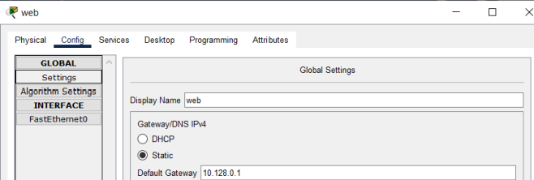{#fig:011 width=70%}

{#fig:012 width=70%}

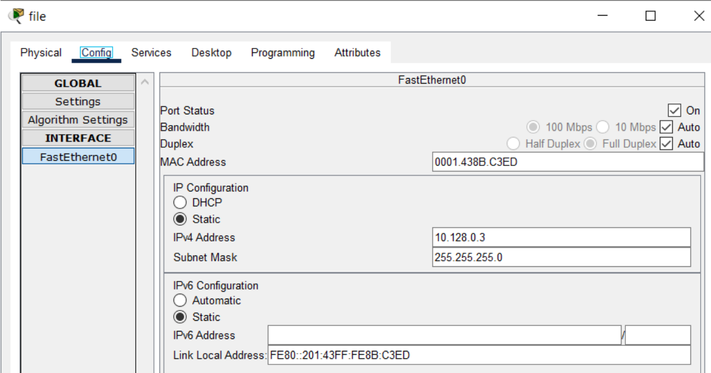{#fig:013 width=70%}

{#fig:014 width=70%}

{#fig:015 width=70%}

{#fig:016 width=70%}

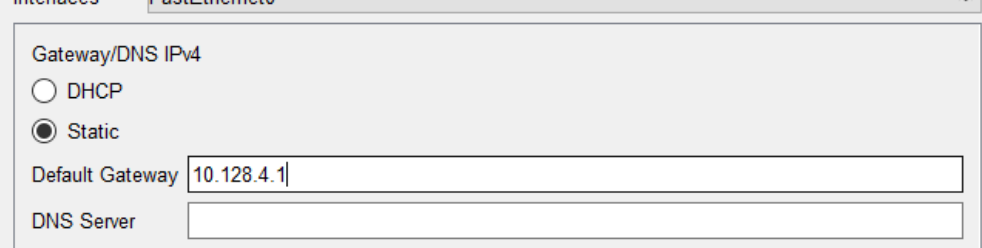{#fig:017 width=70%}

{#fig:018 width=70%}

{#fig:019 width=70%}

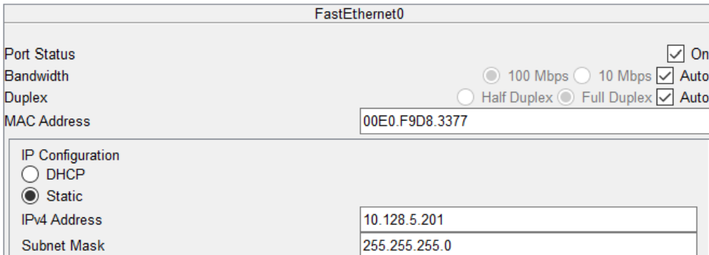{#fig:020 width=70%}

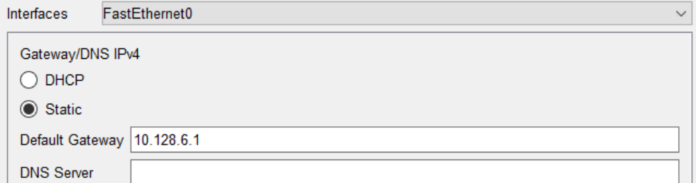{#fig:021 width=70%}

{#fig:022 width=70%}

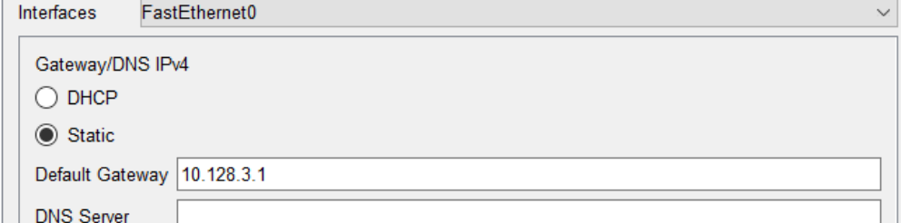{#fig:023 width=70%}

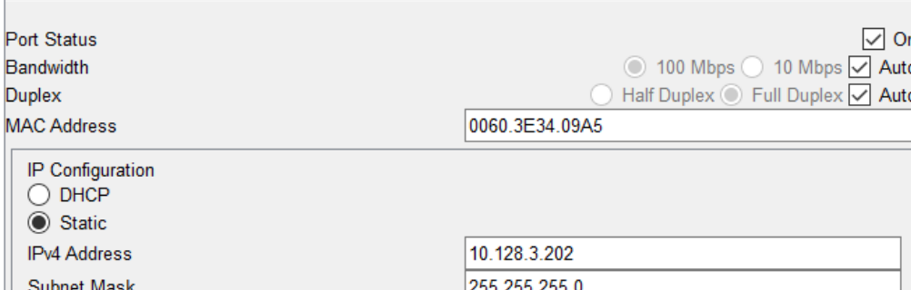{#fig:024 width=70%}

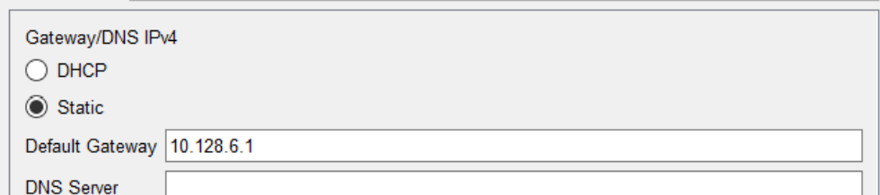{#fig:025 width=70%}

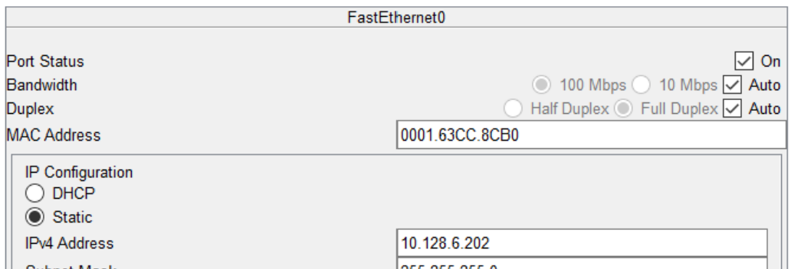{#fig:026 width=70%}

5. Проверила с помощью команды ping доступность устройств, принадлежащих к одному VLAN и недоступность устройств, принадлежащих разным VLAN.(рис. @fig:027).

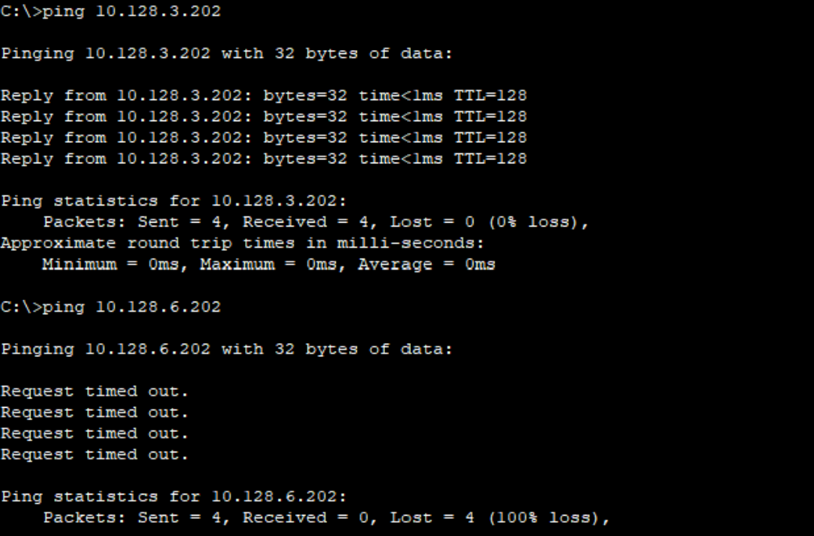{#fig:027 width=70%}

6. Используя режим симуляции, изучила процесс передвижения пакета ICMP по сети. Должна была, но у меня этого пакета не было, к сожалению.

# Контрольные вопросы

1. Какая команда используется для просмотра списка VLAN на сетевом устройстве?

show vlan (sh vlan)

2. Охарактеризуйте VLAN Trunking Protocol (VTP). Приведите перечень команд с пояснениями для настройки и просмотра информации о VLAN.

Протокол VTP (англ. VLAN Trunking Protocol) — протокол ЛВС, служащий для обмена информацией о VLAN (виртуальных сетях), имеющихся на выбранном транковом порту. Разработан и используется компанией Cisco.

•	show vlan — выводит подробный список номеров и имён VLAN, активных на коммутаторе, а также портов, назначенных в каждую из них;

•	switchport access vlan vlan_number - команды для назначения отдельных портов в сети VLAN;

•	switchport access vlan vlan_number - команды для назначения диапазонов портов в сети VLAN.

3. Охарактеризуйте Internet Control Message Protocol (ICMP). Опишите формат пакета ICMP.

Протокол Internet Control Message Protocol (ICMP) – это набор коммуникационных правил, которые устройства используют для распространения информации об ошибках передачи данных в сети. При обмене сообщениями между отправителем и получателем могут возникнуть непредвиденные ошибки. Например, сообщения могут быть слишком длинными или пакеты данных могут приходить не по порядку, поэтому получатель не может их организовать.
Формат пакета ICMP включает следующие поля:

•	Идентификатор (обычно это идентификатор процесса) и номер по порядку (увеличивается на 1 при посылке каждого пакета). Эти поля служат для того, чтобы отправитель мог связать в пары запросы и отклики.

•	Тип определяет, является ли этот пакет запросом (8) или откликом (0).

•	Контрольная сумма представляет собой 16-разрядное дополнение по модулю 1 контрольной суммы всего ICMP-сообщения, начиная с поля тип.

•	Данные служит для записи информации, возвращаемой отправителю.

4. Охарактеризуйте Address Resolution Protocol (ARP). Опишите формат пакета ARP.

ARP - протокол разрешения адресов (Address Resolution Protocol) является протоколом третьего (сетевого) уровня модели OSI, используется для преобразования IP-адресов в MAC-адреса, играет важную функцию в множественном доступе сетей.
Формат сообщения ARP включает следующие поля:

•	Тип оборудования. Размер поля равен 2 байтам. Определяет тип оборудования, используемое для передачи сообщения. Наиболее распространённый тип оборудования — Ethernet. Значение Ethernet равно 1.

•	Тип протокола. Указывает, какой протокол использовался для передачи сообщения. Значение этого поля равно 2048, что указывает на IPv4.

•	Длина аппаратного адреса. Показывает длину сетевого адреса в байтах. Размер MAC-адреса Ethernet составляет 6 байт.

•	Длина адреса протокола. Показывает размер IP-адреса в байтах. Размер IP-адреса равен 4 байтам.

•	Операционный закон. Указывает тип сообщения. Если значение этого поля равно 1, то это сообщение-запрос, а если значение этого поля равно 2, то это ответное сообщение.

•	Аппаратный адрес отправителя. Содержит MAC-адрес устройства, передающего сообщение.

5. Что такое MAC-адрес? Какова его структура?

MAC-адрес — это уникальный код, присвоенный производителем сетевому устройству (например, беспроводному сетевому адаптеру или ethernet-адаптеру). MAC — это сокращение от Media Access Control. Предполагается, что каждый код является уникальным для определённого устройства. MAC-адрес состоит из шести групп по два символа, разделённых двоеточиями.

# Выводы

Я получила основные навыки по настройке VLAN на коммутаторах сети.

# Список литературы{.unnumbered}

::: {#refs}
:::
