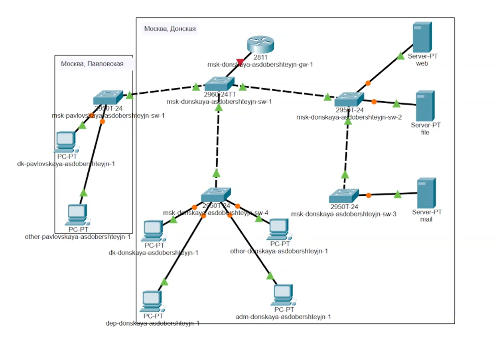
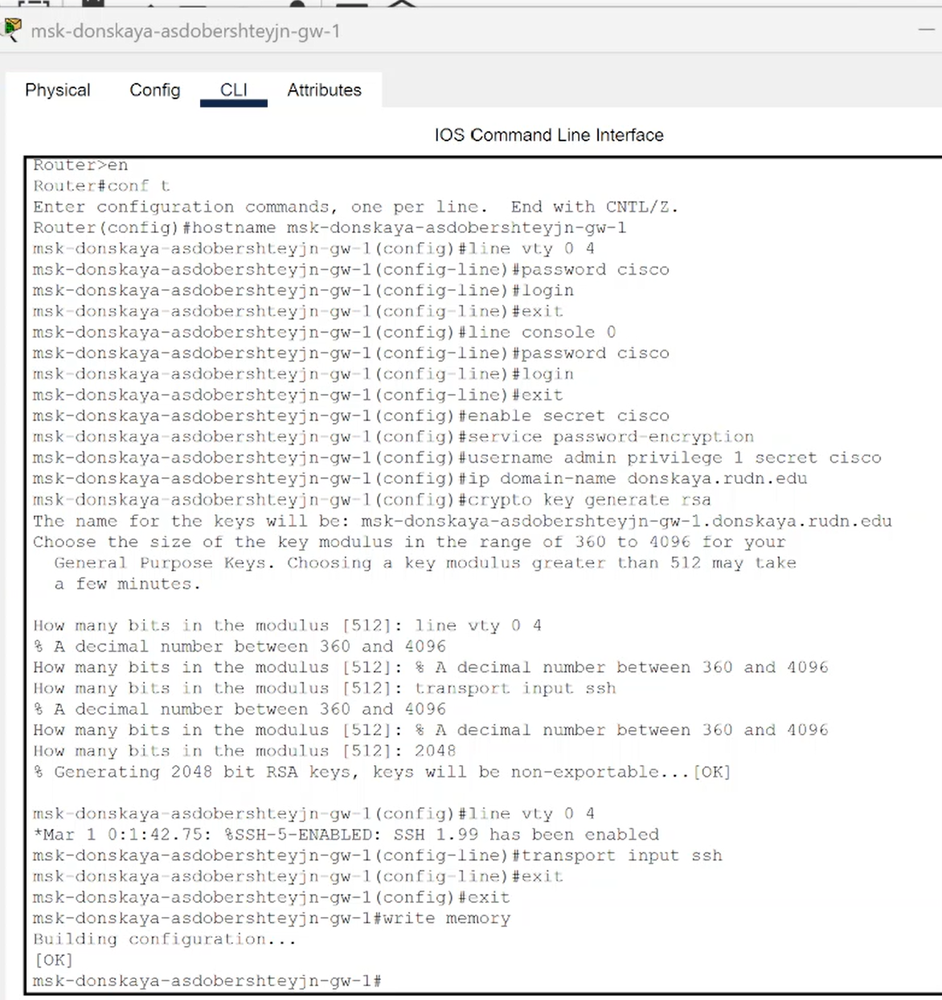
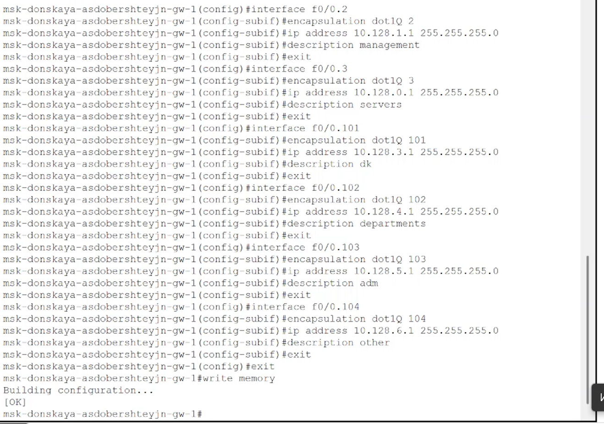

---
## Front matter
lang: ru-RU
title: "Презентация по лабораторной работе №6"
subtitle: "Дисциплина: Администрирование локальных сетей"
author:
  - Доберштейн А.C.
institute:
  - Российский университет дружбы народов, Москва, Россия
date: 04 апреля 2025

## i18n babel
babel-lang: russian
babel-otherlangs: english

## Formatting pdf
toc: false
toc-title: Содержание
slide_level: 2
aspectratio: 169
section-titles: true
theme: metropolis
header-includes:
 - \metroset{progressbar=frametitle,sectionpage=progressbar,numbering=fraction}
 - '\makeatletter'
 - '\beamer@ignorenonframefalse'
 - '\makeatother'
---

# Информация

## Докладчик

  * Доберштейн Алина Сергеевна
  * 1132226448
  * НФИбд-02-22

# Цель работы

Настроить статическую маршрутизацию VLAN в сети.

# Задание

1. Добавить в локальную сеть маршрутизатор, провести его первоначальную настройку.

2. Настроить статическую маршрутизацию VLAN.

3. При выполнении работы необходимо учитывать соглашение об именовании.

# Выполнение лабораторной работы

##

1. В логической области разместила маршрутизатор Cisco 2811, подключила его к порту 24 кммутатор msk-donskaya-asdobershteyjn-sw-1. (рис. @fig:001).

{#fig:001 width=50%}

##

2. Сконфигурировала маршрутизатор, задав на нем имя, пароль для доступа к консоли, настроила удаленное подключение к нему по ssh.(рис. @fig:002).

{#fig:002 width=30%}

##

3. Настроила порт 24 коммутатора msk-donskaya-asdobershteyjn-sw-1 как trunk-порт.(рис. @fig:003).

{#fig:003 width=50%}

##

4. На интерфейсе f0/0 маршрутизатора msk-donskaya-asdobershteyjn-gw-1 настроила виртуальные интерфейсы, соответствующие номерам VLAN. Согласно таблице IP-адресов задала соответствующие IP-адреса на виртуальных интерфейсах.(рис. @fig:004).

{#fig:004 width=50%}

##

5. Проверила доступность оконечных устройств из разных VLAN. (рис. @fig:005).

{#fig:005 width=70%}

##

{#fig:006 width=70%}

##

6. Используя режим симуляции, изучила процесс передвижения пакета ICMP по сети. (рис. @fig:007).

{#fig:007 width=70%}

##

7. Изучила содержимое передаваемого пакета и заголовки задействованных протоколов.

# Выводы

Я настроила статическую маршрутизацию VLAN в сети.
