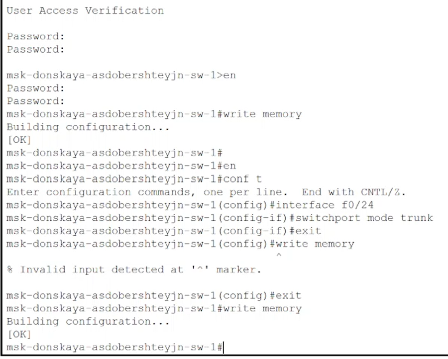
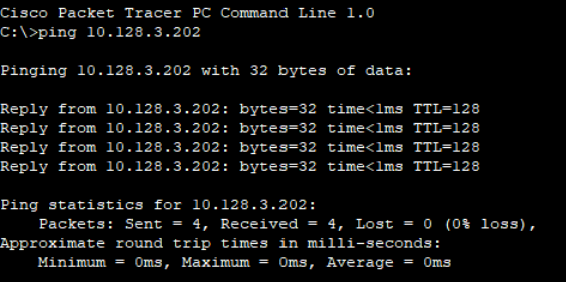
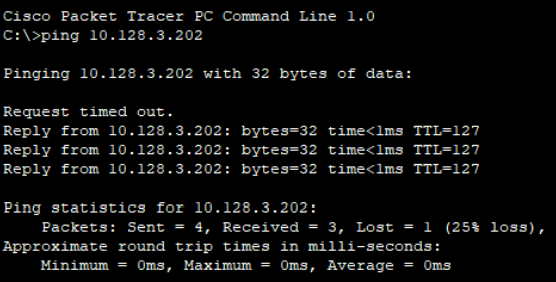
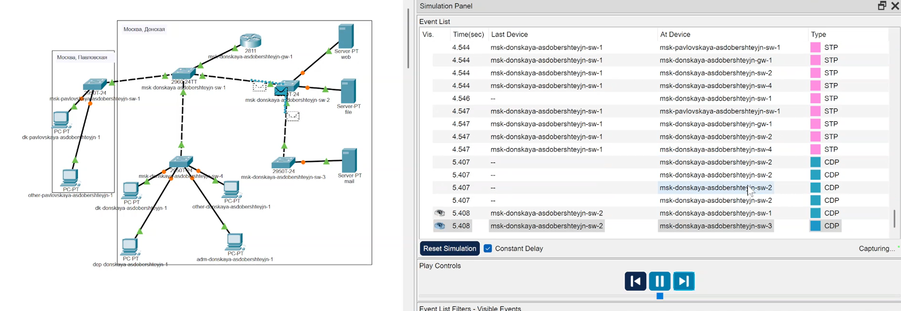

---
## Front matter
title: "Отчет по лабораторной работе №6"
subtitle: "Дисциплина: Администрирование локальных сетей"
author: "Доберштейн Алина Сергеевна"

## Bibliography
bibliography: bib/cite.bib
csl: pandoc/csl/gost-r-7-0-5-2008-numeric.csl

## Pdf output format
toc: true # Table of contents
toc-depth: 2
lof: true # List of figures
lot: true # List of tables
fontsize: 12pt
linestretch: 1.5
papersize: a4
documentclass: scrreprt
## I18n polyglossia
polyglossia-lang:
  name: russian
  options:
	- spelling=modern
	- babelshorthands=true
polyglossia-otherlangs:
  name: english
## I18n babel
babel-lang: russian
babel-otherlangs: english
## Fonts
mainfont: PT Serif
romanfont: PT Serif
sansfont: PT Sans
monofont: PT Mono
mainfontoptions: Ligatures=TeX
romanfontoptions: Ligatures=TeX
sansfontoptions: Ligatures=TeX,Scale=MatchLowercase
monofontoptions: Scale=MatchLowercase,Scale=0.9
## Biblatex
biblatex: true
biblio-style: "gost-numeric"
biblatexoptions:
  - parentracker=true
  - backend=biber
  - hyperref=auto
  - language=auto
  - autolang=other*
  - citestyle=gost-numeric
## Pandoc-crossref LaTeX customization
figureTitle: "Рис."
tableTitle: "Таблица"
listingTitle: "Листинг"
lofTitle: "Список иллюстраций"
lotTitle: "Список таблиц"
lolTitle: "Листинги"
## Misc options
indent: true
header-includes:
  - \usepackage{indentfirst}
  - \usepackage{float} # keep figures where there are in the text
  - \floatplacement{figure}{H} # keep figures where there are in the text
---

# Цель работы

Настроить статическую маршрутизацию VLAN в сети.

# Задание

1. Добавить в локальную сеть маршрутизатор, провести его первоначальную настройку.

2. Настроить статическую маршрутизацию VLAN.

3. При выполнении работы необходимо учитывать соглашение об именовании.

# Выполнение лабораторной работы
1. В логической области разместила маршрутизатор Cisco 2811, подключила его к порту 24 кммутатор msk-donskaya-asdobershteyjn-sw-1. (рис. @fig:001).

{#fig:001 width=70%}

2. Сконфигурировала маршрутизатор, задав на нем имя, пароль для доступа к консоли, настроила удаленное подключение к нему по ssh.(рис. @fig:002).

{#fig:002 width=70%}

3. Настроила порт 24 коммутатора msk-donskaya-asdobershteyjn-sw-1 как trunk-порт.(рис. @fig:003).

{#fig:003 width=70%}

4. На интерфейсе f0/0 маршрутизатора msk-donskaya-asdobershteyjn-gw-1 настроила виртуальные интерфейсы, соответствующие номерам VLAN. Согласно таблице IP-адресов задала соответствующие IP-адреса на виртуальных интерфейсах.(рис. @fig:004).

{#fig:004 width=70%}

5. Проверила доступность оконечных устройств из разных VLAN. (рис. @fig:005).

{#fig:005 width=70%}

{#fig:006 width=70%}

6. Используя режим симуляции, изучила процесс передвижения пакета ICMP по сети. (рис. @fig:007).

{#fig:007 width=70%}

7. Изучила содержимое передаваемого пакета и заголовки задействованных протоколов.

# Контрольные вопросы

1. Охарактеризуйте стандарт IEEE 802.1Q.

Стандарт IEEE 802.1Q определяет механизм VLAN tagging (метки VLAN) в локальных сетях Ethernet.  Он позволяет разделить одну физическую сеть на множество логических сетей (VLAN), изолируя трафик между ними.  Это обеспечивает гибкость, безопасность и улучшенное управление сетью.  Ключевые особенности:

 Внедрение VLAN:  802.1Q добавляет тег к существующим Ethernet кадрам, который идентифицирует VLAN, к которому принадлежит кадр.  Это позволяет маршрутизаторам и коммутаторам обрабатывать трафик на основе VLAN, направляя его только в предназначенные VLAN.
 Совместимость:  Стандарт разработан для обеспечения совместимости с существующими Ethernet сетями.  Устройства, не поддерживающие 802.1Q, могут обрабатывать помеченные кадры, игнорируя тег.
 Инкапсуляция:  Процесс добавления тега происходит путем инкапсуляции оригинального Ethernet кадра внутри нового кадра 802.1Q.
 Маршрутизация VLAN:  Позволяет маршрутизировать трафик между VLAN, используя маршрутизаторы или межсетевые экраны.
 Улучшение безопасности:  Изоляция VLAN повышает безопасность сети, предотвращая несанкционированный доступ к данным.
 Улучшение производительности:  Разделение сети на VLAN может улучшить производительность, снижая сетевую загрузку.

2. Опишите формат кадра IEEE 802.1Q.

Кадр 802.1Q состоит из оригинального Ethernet кадра, "обернутого" в тег 802.1Q.  Это расширяет размер оригинального Ethernet кадра.  Структура выглядит следующим образом:

1. Preamble (Преамбула):  7 байт, используется для синхронизации приемника.  Остается неизменным.
2. Start Frame Delimiter (SFD):  1 байт, указывает начало кадра. Остается неизменным.
3. Ethernet Header (Заголовок Ethernet):  14 байт, включая:
     Destination MAC Address (MAC-адрес получателя): 6 байт.
     Source MAC Address (MAC-адрес отправителя): 6 байт.
     Ethernet Type (Тип Ethernet): 2 байта.  В оригинальном кадре это поле указывает на тип протокола верхнего уровня (например, IP, ARP).  В 802.1Q оно заменяется тегом.
4. 802.1Q Tag (Тег 802.1Q): 4 байта, добавляется стандартом 802.1Q.  Состоит из:
     TPID (Tag Protocol Identifier): 2 байта, идентификатор протокола тега.  Обычно имеет значение 0x8100.  Этот идентификатор показывает, что следует тег 802.1Q.
     TCI (Tag Control Information): 2 байта, содержит информацию о VLAN:
         PCP (Priority Code Point): 3 бита, приоритет кадра (QoS).
         CFI (Canonical Format Indicator): 1 бит,  указывает на формат кадра (обычно 0).
         VID (VLAN ID): 12 бит, идентификатор VLAN (от 0 до 4095).
5. Ethernet Payload (Полезная нагрузка Ethernet): Переменная длина, данные, которые передаются.
6. Ethernet Frame Check Sequence (FCS): 4 байта, контрольная сумма, обеспечивающая целостность данных.

# Выводы

Я настроила статическую маршрутизацию VLAN в сети.

# Список литературы{.unnumbered}

::: {#refs}
:::
