---
## Front matter
lang: ru-RU
title: "Презентация по лабораторной работе №7"
subtitle: "Дисциплина: Администрирование локальных сетей"
author:
  - Доберштейн А.C.
institute:
  - Российский университет дружбы народов, Москва, Россия
date: 04 апреля 2025

## i18n babel
babel-lang: russian
babel-otherlangs: english

## Formatting pdf
toc: false
toc-title: Содержание
slide_level: 2
aspectratio: 169
section-titles: true
theme: metropolis
header-includes:
 - \metroset{progressbar=frametitle,sectionpage=progressbar,numbering=fraction}
 - '\makeatletter'
 - '\beamer@ignorenonframefalse'
 - '\makeatother'
---

# Информация

## Докладчик

  * Доберштейн Алина Сергеевна
  * 1132226448
  * НФИбд-02-22

# Цель работы

Получить навыки работы с физической рабочей областью Packet Tracer, а также учесть физические параметры сети.

# Задание

Требуется заменить соединение между коммутаторами двух территорий msk-donskaya-sw-1 и msk-pavlovskaya-sw-1 на соединение, учитывающее физические параметры сети, а именно — расстояние между двумя территориями.
При выполнении работы необходимо учитывать соглашение об именовании.

# Выполнение лабораторной работы

##

1. Открыла проект предыдущей лаб работы. Перешла в физическую рабочую область. Присвоила название городу - Moscow. (рис. @fig:001).

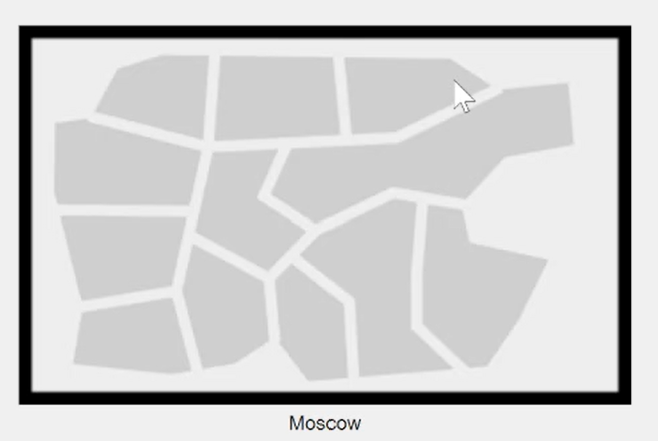{#fig:001 width=70%}

##

2. Щелкнув на изображение города, увидела изображение здания, присвоила ему название Donskaya. Добавила здание для территории Pavlovskaya. (рис. @fig:002).

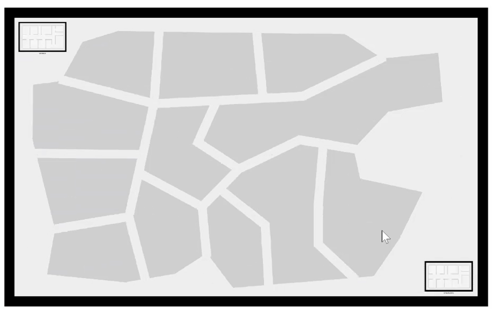{#fig:002 width=70%}

##

3. Щелкнув на изображение здания donskaya, переместила изображение, обозначающее серверное помещение, в него.(рис. @fig:003).

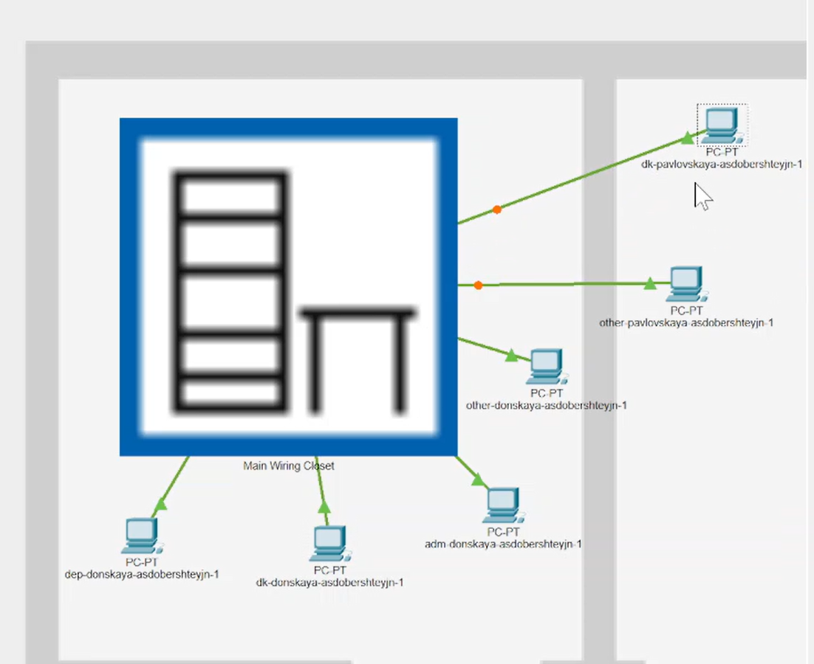{#fig:003 width=50%}

##

4. Щелкнув на изображение серверной, увидела отображение серверных стоек.(рис. @fig:004).

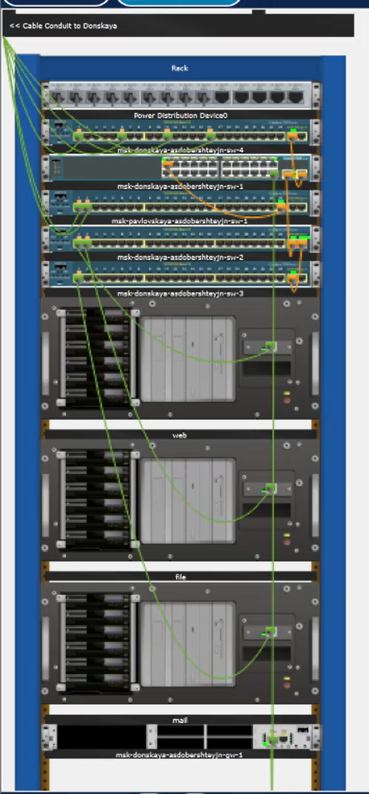{#fig:004 width=20%}

##

5. Переместила коммутатор msk-pavlovskaya-sw-1 и два оконечных устройства dk-pavlovskaya-1 и other-pavlovskaya-1 на территорию Pavlovskaya.

##

6. Вернушвись в логическую рабочую область, пропинговала с коммутатора msk-donskaya-sw-1 коммутатор msk-pavlovskaya-sw-1.(рис. @fig:006)

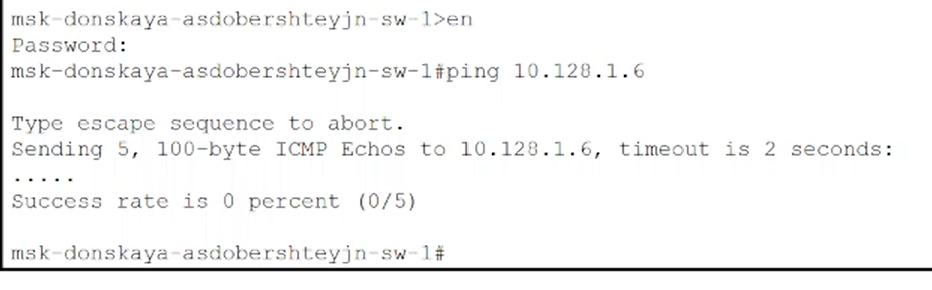{#fig:006 width=70%}

##

7. В меню Options, Preferences во вкладке Interface активировала разрешение на учет физичсеких характеристик среды передачи. (рис. @fig:007).

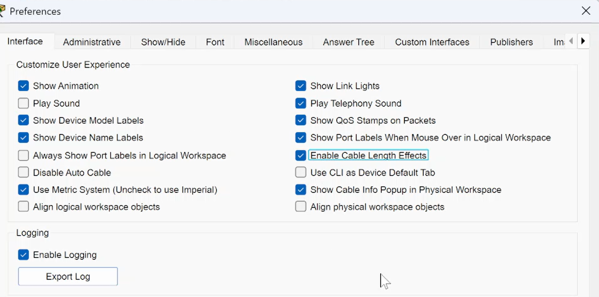{#fig:007 width=70%}

##

8. В физической рабочей области разместла две территории на расстоянии более 100 м друг от друа.

##

9. Вернувшись в логическую область, пропинговала с коммутатора msk-donskaya-sw-1 коммутатор msk-pavlovskaya-sw-1. Убедилась в неработоспособности соединения.(рис. @fig:008).

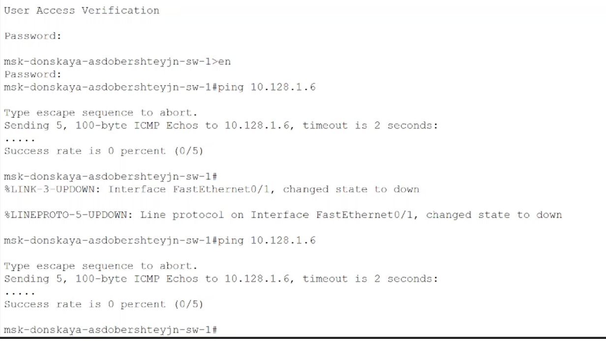{#fig:008 width=70%}

##

10. Удалила соединение между msk-donskaya-sw-1 и msk-pavlovskaya-sw-1. Добавила в логическую область два повториеля RepeaterPT. Присвоила им соответствующие названия. Заменила имеющиеся модули на PT-REPEATERNM-1FEE и PT-REPEATER-NM-1CFE для подключения оптоволокна и витой пары по технологии Fast Ethernet.(рис. @fig:010).

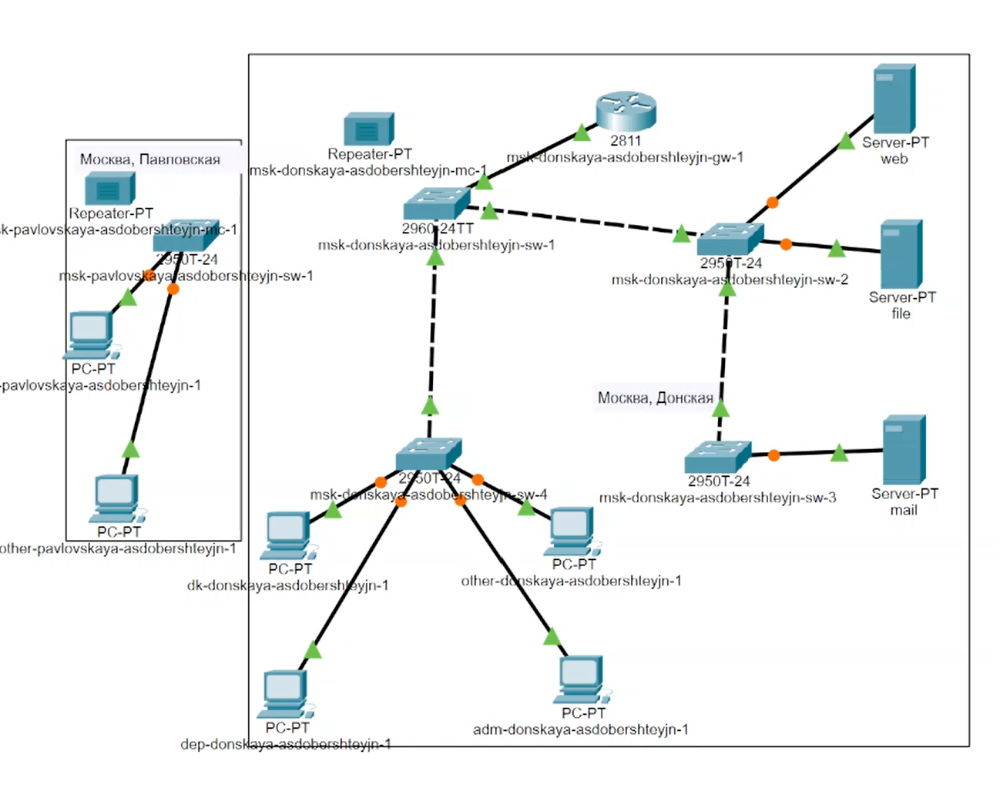{#fig:09 width=30%}

##

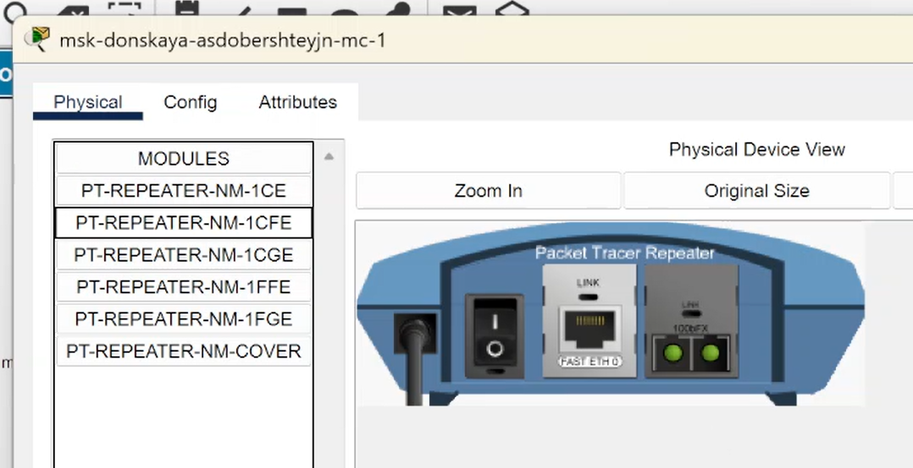{#fig:010 width=70%}

##
11.  Переместила msk-pavlovskaya-mc-1 на территорию Pavlovskaya (в физической рабочей области Packet Tracer).(рис. @fig:010).

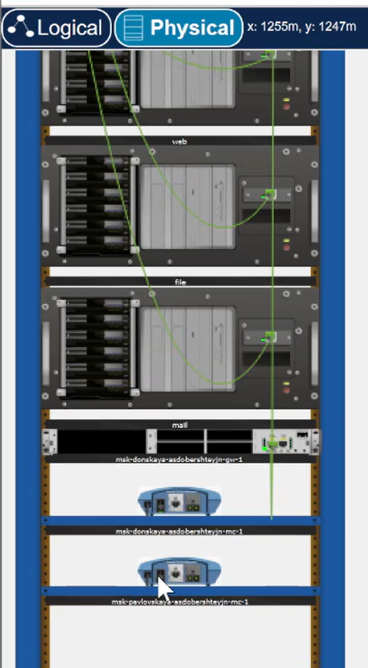{#fig:011 width=20%}

##

12. Подключила коммутатор msk-donskaya-sw-1 к msk-donskaya-mc-1 по витой паре, msk-donskaya-mc-1 и msk-pavlovskaya-mc-1 — по оптоволокну, msk-pavlovskaya-sw-1 к msk-pavlovskaya-mc-1 — по витой паре.(рис. @fig:012).

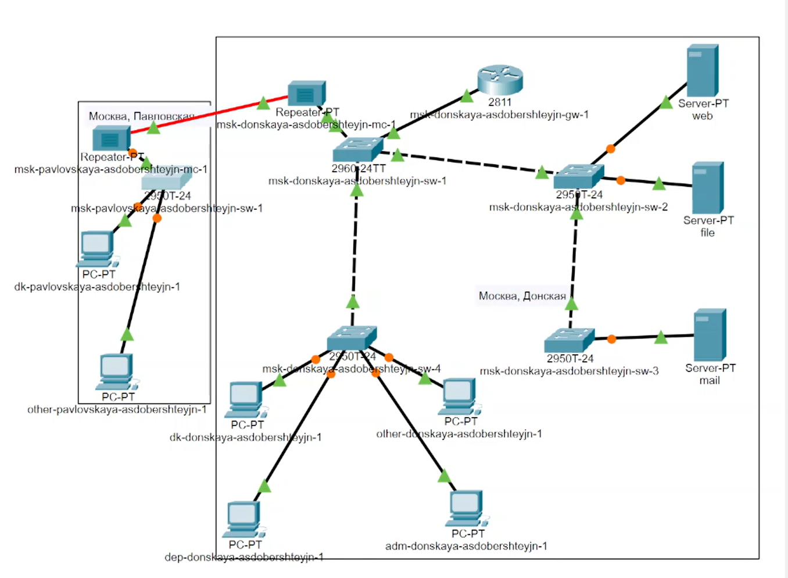{#fig:012 width=30%}

##

13. Убедилась в работоспособности соединения между msk-donskaya-sw-1 и msk-pavlovskaya-sw-1, пропинговав.(рис. @fig:013).

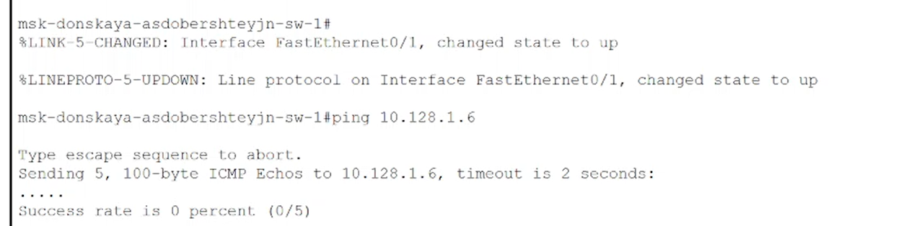{#fig:013 width=70%}

# Выводы

Я получила навыки работы с физической рабочей областью Packet Tracer, а также учла физические параметры сети.
